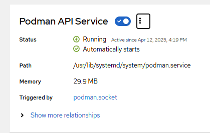
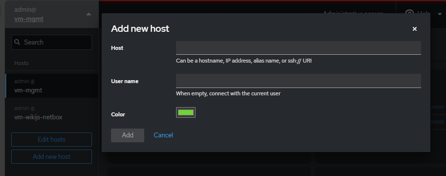

# Installation guide

Project 1: Deployment 1.

## Introduction

- [Installation guide](#installation-guide)
  - [Introduction](#introduction)
  - [Prerequisites](#prerequisites)
    - [Software requirements](#software-requirements)
    - [Network requirements](#network-requirements)
    - [Hardware requirements](#hardware-requirements)
  - [Base image](#base-image)
  - [Software install Cockpit adn addons](#software-install-cockpit-adn-addons)
    - [Cockpit](#cockpit)
      - [Cockpit podman](#cockpit-podman)
      - [Cockpit File manager](#cockpit-file-manager)
    - [Hardening the base image](#hardening-the-base-image)
      - [Install Lynis from CISOfy and use it for hardening](#install-lynis-from-cisofy-and-use-it-for-hardening)
      - [SSH](#ssh)
      - [Firewall enable only](#firewall-enable-only)
      - [Disable compilers](#disable-compilers)
      - [Put banners](#put-banners)
      - [User admin strong password](#user-admin-strong-password)
      - [Lynus enable only for admin user](#lynus-enable-only-for-admin-user)
      - [Remove all the Lynis logs](#remove-all-the-lynis-logs)
      - [History](#history)
  - [VMs setup for the lab](#vms-setup-for-the-lab)
    - [vm-mgmt](#vm-mgmt)
      - [Oracle VirtualBox Network settings:](#oracle-virtualbox-network-settings)
      - [Security](#security)
        - [SSH](#ssh-1)
        - [sshuser disable bash and python](#sshuser-disable-bash-and-python)
    - [vm-wikijs-netbox](#vm-wikijs-netbox)
      - [Oracle VirtualBox Network settings](#oracle-virtualbox-network-settings-1)
      - [WikiJS service set](#wikijs-service-set)
        - [PostgreSQL](#postgresql)
        - [WikiJS](#wikijs)
        - [podman-compose deployment](#podman-compose-deployment)
        - [VirtualBox Backup](#virtualbox-backup)
      - [Netbox service set](#netbox-service-set)
        - [PostgreSQL](#postgresql-1)
        - [Redis](#redis)
        - [Netbox](#netbox)
        - [podman-compose deployment](#podman-compose-deployment-1)
        - [Create a screenshot on the machine](#create-a-screenshot-on-the-machine)
      - [Security with SELinux, Trivy and LinPEAS](#security-with-selinux-trivy-and-linpeas)
    - [vm-reproxy](#vm-reproxy)
      - [Oracle VirtualBox Network settings](#oracle-virtualbox-network-settings-2)
      - [Nginx service set](#nginx-service-set)
    - [Cockpit web console](#cockpit-web-console)
  - [TIPS](#tips)
    - [Oracle VirtualBox](#oracle-virtualbox)
      - [See vms IP addresses](#see-vms-ip-addresses)

## Prerequisites

### Software requirements

- Oracle VirtualBox installed in the host machine.
- VirtualBox Guest Additions installed in the guest machine.

### Network requirements

- Create a **Host-Only** network in VirtualBox for `IntNetSrv` the VMs to communicate with each other.
- Create a **Host-Only** network in VirtualBox for `IntNetMgmt` the VMs to communicate with each other.

**Reference link**: [VirtualBox Host-Only Network](https://www.youtube.com/watch?v=cxCvv__AfCY)

### Hardware requirements

- Memory: 8GB of RAM in the host machine.
- CPU: 4 cores in the host machine.
- Disk: 50GB of disk space in the host machine.

## Base image

1. Install some packages and upgrade:

    ```bash
    sudo dnf install nano
    sudo dnf install nmap
    sudo dnf install nmap
    sudo dnf upgrade
    sudo reboot
    ```

2. Deactivate SELinux enforcing mode:

    ```bash
    sudo sed -i 's/^SELINUX=.*/SELINUX=permissive/' /etc/selinux/config
    sudo reboot
    ```

3. VirtualBox Guest Additions installation: [Reference link used:](https://linuxconfig.org/install-virtualbox-guest-additions-on-linux-guest)

    ```bash
    sudo mkdir -p /mnt/cdrom
    cd /mnt/cdrom/
    sudo mount /dev/cdrom /mnt/cdrom/
    cd /mnt/cdrom/
    sudo dnf install tar bzip2 kernel-devel kernel-headers perl make elfutils-libelf-devel
    sudo ./VBoxLinuxAdditions.run
    sudo reboot
    ```

**NOTE**: remember to uninstall the extra packages installed for the VirtualBox Guest Additions installation.

## Software install Cockpit adn addons

### Cockpit

1. Install Cockpit

    If the web console is not installed by default on your installation variant, manually install the cockpit package:

    ```bash
    sudo dnf install cockpit
    ```

2. Enable and start the cockpit.socket service, which runs a web server:

    ```bash
    sudo systemctl enable --now cockpit.socket
    ```

#### Cockpit podman

This addon install the `cockpit-podman` addon to manage the containers in the VMs and also install `podman` in the VM.

```bash
sudo dnf install cockpit-podman
```

Also need to enable the podman socket, in `cockpit-podman` menu in **cockpit**, we can start the podman socket in `Services > podman`.

Your web gui have to look like this:



#### Cockpit File manager

This addon install the `cockpit-files` addon to manage the files in the web console.

```bash
sudo dnf install cockpit-files
```

### Hardening the base image

- Pre-hardening level: 67
- Post-hardening level: 76

#### Install Lynis from CISOfy and use it for hardening

1. Create the repository in `/etc/yum.repos.d/cisofy-lynis.repo`:

    ```bash
    sudo tee /etc/yum.repos.d/cisofy-lynis.repo <<'EOF'
    [lynis]
    name=CISOfy Software - Lynis package
    baseurl=https://packages.cisofy.com/community/lynis/rpm/
    enabled=1
    gpgkey=https://packages.cisofy.com/keys/cisofy-software-rpms-public.key
    gpgcheck=1
    priority=2
    ```

2. Install Lynis:

    ```bash
    sudo dnf install lynis
    ```

3. Use of Lynis to increase base image hardening.

- Audit command:

```bash
sudo lynis audit system | sudo tee /var/log/lynis-report-prehardening-$(date +%d%m%Y).log
```

#### SSH

1. SSHD configuration Lynis reference.
2. Create a `sshuser` with less privileges.
3. Config in `/etc/ssh/sshd_config.d/sshd.conf`:

```bash
"AllowTcpForwarding" "no" 
"ClientAliveCountMax" "2" 
"LogLevel" "VERBOSE" 
"MaxAuthTries" "3" 
"MaxSessions" "3" 
"TCPKeepAlive" "no" 
"X11Forwarding" "no" 
"AllowAgentForwarding" "no" 
```

<!-- 
1. Allow SSH access to `sshuser` only.

    ```bash
    sudo sed -i 's/^#PermitRootLogin.*/PermitRootLogin no/' /etc/ssh/sshd_config && echo "AllowUsers sshuser" | sudo tee -a /etc/ssh/sshd_config
    ``` 
-->

#### Firewall enable only

Enable ssh port and cockpit port for `public` firewalld zone.

#### Disable compilers

REF Lynis: HRDN-7222.

- After searching for the compilers installed in the system, we can remove them.

```bash
sudo dnf remove gcc make perl 
```

#### Put banners

Reference Lynis: HRDN-7126 and HRDN-7130.

1. And /etc/issue and /etc/issue.net:

    ```bash
    sudo tee /etc/issue /etc/issue.net <<'EOF'
    *********************************************************************
    WARNING: UNAUTHORIZED ACCESS PROHIBITED

    This system is:
    - Restricted to authorized users only
    - Actively monitored and audited 24/7
    - Subject to legal enforcement

    By accessing this system, you acknowledge:
    1. You are an authorized user
    2. All activity is logged (including keystrokes/commands)
    3. No expectation of privacy exists
    4. Violations will be reported to law enforcement

    Unauthorized use may result in civil/criminal penalties.
    *********************************************************************
    EOF
    ```

#### User admin strong password

Just use a strong password for the `admin` user.

#### Lynus enable only for admin user

In case of any attacker, it cannot execute a scan to see the hardening level of the system and other vulnerabilities.

```bash
sudo chmod o-x $(which lynis)
```

#### Remove all the Lynis logs

To prevent an attacker from seeing the hardening level of the system, we need to remove all the Lynis logs.

```bash
sudo rm -r /var/log/lynis*
```

#### History

Disabling the history of base image and hardening.
    
```bash
history -c
```

## VMs setup for the lab

### vm-mgmt

**Purpose:**
This VM es used to manage the other VMs in the lab. It is used to run the following tools:

- Host Cockpit (web UI) with Podman and File manager addons.
- Podman client.
- Ansible(maybe)
- Of course, SSH client.

#### Oracle VirtualBox Network settings:

Adapter 1: NAT (for internet access) with port forwarding for SSH (2222:2222) and cockpit (9090:9090).

- This is for the `ExtNetHome` network in the diagram.

Adapter 2: **Internal Network** adapter for communication with the other VMs.

- This is for the `IntNetMgmt` network in the diagram, to manage the other VMs. 

#### Security

##### SSH

I put banners for SSH and login.

1. SSH banner:

    ```bash
    sudo nano /etc/ssh/sshd_banner
    *****************************************************************
    WARNING: UNAUTHORIZED ACCESS PROHIBITED

    You are accessing a private computer system. This system is:
    - Restricted to authorized users ONLY
    - Actively monitored 24/7
    - Subject to audit logging and legal enforcement

    By proceeding, you:
    1. Acknowledge you are an authorized user
    2. Consent to ALL activity being monitored and recorded
    3. Accept legal liability for unauthorized actions

    All access attempts are logged with:
    - Timestamps
    - Source IP
    - Commands executed

    Violators will be prosecuted to the fullest extent of the law.
    *****************************************************************
    ```

    ```bash
    sudo sed -i 's/^#Banner.*/Banner \/etc\/ssh\/sshd_banner/' /etc/ssh/sshd_config
    ```

2. Only let `sshuser` to log in with SSH:

    ```bash
    sudo sed -i 's/^#PermitRootLogin.*/PermitRootLogin no/' /etc/ssh/sshd_config && echo "AllowUsers sshuser" | sudo tee -a /etc/ssh/sshd_config
    ```

##### sshuser disable bash and python

References: [text](https://linuxtldr.com/restricted-bash-shell/) [RBash](https://www.tecmint.com/rbash-restricted-bash-shell/)

1. We need to restrict the `sshuser` to use only a restricted shell. We can use `rbash` for this. All of these is made in the `sshuser` bash profile by admin user.

    ```bash
    sudo -u sshuser nano /home/sshuser/.bashrc
    ```

2. Put the following lines in the `.bashrc` file:

    ```bash
    # .bashrc

    # Source global definitions
    if [ -f /etc/bashrc ]; then
            . /etc/bashrc
    fi

    # User specific environment
    if ! [[ "$PATH" =~ "$HOME/.local/bin:$HOME/bin:" ]]
    then
        PATH="$HOME/.local/bin:$HOME/bin:$PATH"
    fi
    export PATH

    # Uncomment the following line if you don't like systemctl's auto-paging feature:
    # export SYSTEMD_PAGER=

    # User specific aliases and functions
    if [ -d ~/.bashrc.d ]; then
            for rc in ~/.bashrc.d/*; do
                    if [ -f "$rc" ]; then
                            . "$rc"
                    fi
            done
    fi

    unset rc

    # Force restricted shell
    set -r

    # Force su - admin command
    function su_admin() {
        if [[ "$1" == "-" && "$2" == "admin" ]]; then
            su - admin  # Only allow "su - user"
        else
            echo "Error: Only 'su - admin' is permitted."
            return 1
        fi
    }

    alias su='su_admin'
    alias ls='echo "Command blocked"'
    alias cat='echo "Command blocked"'
    alias cp='echo "Command blocked"'
    alias mv='echo "Command blocked"'
    alias rm='echo "Command blocked"'
    alias vi='echo "Command blocked"'
    alias vim='echo "Command blocked"'
    alias python='echo "Command blocked"'
    alias python3='echo "Command blocked"'
    alias ssh='echo "Command blocked"'
    alias curl='echo "Command blocked"'
    alias wget='echo "Command blocked"'
    alias exec='echo "Command blocked"'
    alias eval='echo "Command blocked"'
    alias source='echo "Command blocked"'
    alias nmap='echo "Command blocked"'
    alias ping='echo "Command blocked"'
    alias ip='echo "Command blocked"'
    # Lock down PATH
    export PATH=/usr/bin:/bin
    ```

3. Then save and exit the file. 

4. Now lockdown write permissions for the `sshuser` to bash profile files:

    ```bash
    sudo chattr +i /home/sshuser/.bashrc
    sudo chattr +i /home/sshuser/.bash_profile
    ```

- Previous steps deactivates all commands unless the `su - admin`. And the use of the `bash -r` to be able of log in with ssh and change to `admin` user.

### vm-wikijs-netbox

**Purpose**:
This VM is used to run the web applications WikiJS and Netbox. It is used to run the following tools:

- Podman (for running the web applications)
- WikiJS
- Netbox
- PostgreSQL (for WikiJS and Netbox)
- Redis (for Netbox)

#### Oracle VirtualBox Network settings

Adapter 1: **NAT Network** deactivated, only in case of test internet access if not NAT is provided by the `vm-mgmt` VM.

Adapter 2: **Internal Network** adapter for communication with the other VMs.

- This is for the `IntNetMgmt` network in the diagram, to be manage by **vm-mgmt**.

Adapter 3: **Internal Network** adapter for communication with the applications.

- This is for the `IntNetSrv` network in the diagram, to communication with **vm-reproxy** to receive requests.

#### WikiJS service set

This is a combination of two services: WikiJS and PostgreSQL.

1. Here create a network only for this set of services:

    ```bash
    podman network create wikijs-service-set
    ```

    **NOTE:** see the configuration with in `podman network inspect wikijs-service-set`.

    ```json
    "name": "wikijs-service-set",
    "id": "f224b61a04d31984cbe881353815d6a6deee2561ee35ec49bb8c634e75c52c69",
    "driver": "bridge",
    "network_interface": "podman1",
    "created": "2025-04-26T10:43:46.57167705-06:00",
    "subnets": [
      {
        "subnet": "10.89.0.0/24",
        "gateway": "10.89.0.1"
      }
    ],
    "ipv6_enabled": false,
    "internal": false,
    "dns_enabled": true,
    "ipam_options": {
      "driver": "host-local"
    },
    ```

2. Next we are going to create **PostgreSQL** things and then we are going to create the **WikiJS** service.

**NOTE**: for future deployments, we can use ENV variables with ansible, bash or python scripts. With those we can store all the needed variables as secrets and have a more secure and reusable deployment.

Also the use of `podman-compose` or podman pods can be interesting for future deployments.

##### PostgreSQL

1. Use `postgres` image to install **PostgreSQL**:

    ```bash
    podman pull postgres:17-alpine
    ```

2. Create the persistent volume for the **PostgreSQL** database data:

    ```bash
    podman volume create wikijs-set-postgres-data
    ```

3. Create the secrets for **Environment variables** with podman:

    ```bash
    printf "your_secure_password" | podman secret create wikijs_set_postgres_password -
    printf "wikijs" | podman secret create wikijs_set_postgres_user -
    printf "wikidb" | podman secret create wikijs_set_postgres_db -
    ```

4. Deploy the PostgreSQL container:

    - With secrets:

        ```bash
        podman run --name wikijs-set-postgres-service \
            -d \
            --network wikijs-service-set \
            --ip 10.89.0.31 \
            -p 5432:5432 \
            -v wikijs-set-postgres-data:/var/lib/postgresql/data:Z \
            --secret wikijs_set_postgres_user,type=env,target=POSTGRES_USER \
            --secret wikijs_set_postgres_password,type=env,target=POSTGRES_PASSWORD \
            --secret wikijs_set_postgres_db,type=env,target=POSTGRES_DB \
            --restart=unless-stopped \
            postgres:17-alpine
        ```

        **NOTE**: for future deployments, we can use ENV variables with ansible, bash or python scripts. With those we can store all the needed variables as secrets and have a more secure and reusable deployment.

    - Optionally test without secrets:

        ```bash
        podman run --name wikijs-set-postgres-service \
          -d \
          --network wikijs-service-set \
          --ip 10.89.0.31 \  # This IP was planned in the network configuration.
          -p 5432:5432 \
          -v wikijs-set-postgres-data:/var/lib/postgresql/data:Z \
          -e POSTGRES_USER=wikijs \
          -e POSTGRES_PASSWORD=your_secure_password \
          -e POSTGRES_DB=wikidb \
          --restart=unless-stopped \
          postgres:17-alpine
        ```

5. Check the PostgreSQL container is running on designed ports and IP:

    ```bash
    podman ps -a
    ```

6. Check the PostgreSQL logs:

    ```bash
    podman logs wikijs-set-postgres-service
    ```

7. Check the PostgreSQL database:

    ```bash
    podman exec -it wikijs-set-postgres-service psql -U wikijs -d wikidb
    ```

    - In postgres prompt:

    ```bash
    wikidb=# \l
    ```

##### WikiJS

1. Use `ghcr.io/requarks/wiki` to install WikiJS:

    ```bash
    podman pull ghcr.io/requarks/wiki:2.5
    ```

    **NOTE**: recommended not use `latest` tag, because it is not stable and can break the application.

2. Create the environment variables for the WikiJS container:

    - Required variables:

        ```text
        DB_TYPE=postgres
        DB_HOST=localhost
        DB_PORT=5432
        DB_USER=wikijs
        DB_PASS=pass
        DB_NAME=wikidb
        ```

    - Create the needed secrets for **Environment variables** with podman:

        ```bash
        printf "postgres" | podman secret create wikijs_set_wikijs_db_type -
        printf "IP" | podman secret create wikijs_set_wikijs_db_host -
        printf "5432" | podman secret create wikijs_set_wikijs_db_port -
        ```

    - We gonna use podman secrets for the postgres user, password and dbname created before in the PostgreSQL section.

        ```bash
        wikijs_set_postgres_password
        wikijs_set_postgres_user
        wikijs_set_postgres_db
        ```

3. Deploy the WikiJS container:

    We need to run the container with the following:
    - ip of it network
    - listen to the right WikiJS port
    - use secrets
    - set the health check to check if the service is running

    ```bash
    podman run --name wikijs-set-wikijs-service \
        -d \
        --network wikijs-service-set \
        --ip 10.89.0.30 \
        -p 8080:3000 \
        --secret wikijs_set_wikijs_db_type,type=env,target=DB_TYPE \
        --secret wikijs_set_wikijs_db_host,type=env,target=DB_HOST \
        --secret wikijs_set_wikijs_db_port,type=env,target=DB_PORT \
        --secret wikijs_set_postgres_user,type=env,target=DB_USER \
        --secret wikijs_set_postgres_password,type=env,target=DB_PASS \
        --secret wikijs_set_postgres_db,type=env,target=DB_NAME \
        --health-cmd="curl -f http://localhost:3000/healthz || exit 1" \
        --health-start-period=30s \
        --health-retries=3 \
        --restart=unless-stopped \
        wiki:2.5
    ```

    **NOTE**: for future deployments, we can use ENV variables with ansible, bash or python scripts. With those we can store all the needed variables as secrets and have a more secure and reusable deployment.

    - Optionally test without secrets:

    ```bash
    podman run --name wikijs-set-wikijs-service \
        -d \
        --network wikijs-service-set \
        --ip 10.89.0.30 \
        -p 8080:3000 \
        -e DB_TYPE=postgres \
        -e DB_HOST=localhost \
        -e DB_PORT=5432 \
        -e DB_USER=wikijs \
        -e DB_PASS=pass \
        -e DB_NAME=wikidb \
        --restart=unless-stopped \
        wiki:2.5
    ```

4. Check the WikiJS container:

    ```bash
    podman ps -a
    ```

5. Check the WikiJS logs:

    ```bash
    podman logs wikijs-set-wikijs-service
    ```

##### podman-compose deployment

1. Install podman-compose:

    ```bash
    562  python3 -m ensurepip --user
    563  echo 'export PATH="$HOME/.local/bin:$PATH"' >> ~/.bashrc
    564  source ~/.bashrc  # Apply changes
    565  pip3 --version
    566  pip3 install podman-compose --user
    568  podman-compose -v
    ```

    **NOTE**: We install `podman-compose` this way because the `dnf` package is not updated enough to support secrets as we want.

    ```bash

2. Create the `docker-compose.yml` file:

    ```bash
    sudo nano wikijs-set-compose.yml
    ```

3. Compose file:

    ```yml
    version: '3.8'
    services:
      postgres:
        image: postgres:17-alpine
        container_name: wikijs-set-postgres-service
        networks:
          wikijs-service-set:
            ipv4_address: 10.89.0.31
        ports:
          - "5432:5432"
        volumes:
          - wikijs-set-postgres-data:/var/lib/postgresql/data
        secrets:
          - source: wikijs_set_postgres_user
            target: POSTGRES_USER
            type: env
          - source: wikijs_set_postgres_password
            target: POSTGRES_PASSWORD
            type: env
          - source: wikijs_set_postgres_db
            target: POSTGRES_DB
            type: env
        restart: unless-stopped

      wikijs:
        image: wiki:2.5
        container_name: wikijs-set-wikijs-service
        depends_on:
          - postgres
        networks:
          wikijs-service-set:
            ipv4_address: 10.89.0.30
        ports:
          - "8080:3000"
        secrets:
          - source: wikijs_set_wikijs_db_type
            target: DB_TYPE
            type: env
          - source: wikijs_set_wikijs_db_host
            target: DB_HOST
            type: env
          - source: wikijs_set_wikijs_db_port
            target: DB_PORT
            type: env
          - source: wikijs_set_postgres_user
            target: DB_USER
            type: env
          - source: wikijs_set_postgres_password
            target: DB_PASS
            type: env
          - source: wikijs_set_postgres_db
            target: DB_NAME
            type: env
        healthcheck:
          test: ["CMD", "curl", "-f", "http://localhost:3000/healthz"]
          start_period: 30s
          interval: 30s
          timeout: 5s
          retries: 3
        restart: unless-stopped

    networks:
      wikijs-service-set:
        external: true

    volumes:
      wikijs-set-postgres-data:
        external: true

    secrets:
      wikijs_set_postgres_user:
        external: true
      wikijs_set_postgres_password:
        external: true
      wikijs_set_postgres_db:
        external: true
      wikijs_set_wikijs_db_type:
        external: true
      wikijs_set_wikijs_db_host:
        external: true
      wikijs_set_wikijs_db_port:
        external: true
    ```

4. Run the podman-compose command:

    ```bash
    podman-compose -f wikijs-set-compose.yml up -d
    ```

5. Check the containers are running:

    ```bash
    podman ps -a
    ```

##### VirtualBox Backup

Take a snapshot of the VM `vm-wikijs-netbox` with the PostgreSQL and WikiJS services running.

#### Netbox service set

This is a combination of three services: Netbox, PostgreSQL and Redis.

1. First, we need to define the network for the **Netbox** service:

    ```bash
    podman network create netbox-service-set
    ```

    **NOTE:** see the configuration with in `podman network inspect netbox-service-set`.

      ```json
      [
        {
          "name": "netbox-service-set",
          "id": "4297740540cc0422c7929151a31fa5092c25b12e83d5203240b8b285ae5f549f",
          "driver": "bridge",
          "network_interface": "podman2",
          "created": "2025-04-27T10:03:02.884937426-06:00",
          "subnets": [
            {
              "subnet": "10.89.1.0/24",
              "gateway": "10.89.1.1"
            }
          ],
          "ipv6_enabled": false,
          "internal": false,
          "dns_enabled": true,
          "ipam_options": {
            "driver": "host-local"
          },
          "containers": {}
        }
      ]
      ```

2. Then we are going to create **PostgreSQL** and **Redis** things and then we'll the **Netbox** service with podman.

##### PostgreSQL

1. Create the persistent volume for the **PostgreSQL** database data:

    ```bash
    podman volume create netbox-set-postgres-data
    ```

2. Create the secrets for **Environment variables** with podman:

    ```bash
    printf "your_secure_password" | podman secret create netbox_set_postgres_password -
    printf "netbox" | podman secret create netbox_set_postgres_user -
    printf "netboxdb" | podman secret create netbox_set_postgres_db -
    ```

3. Deploy the PostgreSQL container:

    - With secrets:

        ```bash
        podman run --name netbox-set-postgres-service \
            -d \
            --network netbox-service-set \
            --ip 10.89.1.31 \
            -p 5433:5432 \
            -v netbox-set-postgres-data:/var/lib/postgresql/data:Z \
            --secret netbox_set_postgres_db,type=env,target=POSTGRES_DB \
            --secret netbox_set_postgres_password,type=env,target=POSTGRES_PASSWORD \
            --secret netbox_set_postgres_user,type=env,target=POSTGRES_USER \
            --restart=unless-stopped \
            postgres:17-alpine
        ```

        **NOTE**: for future deployments, we can use ENV variables with ansible, bash or python scripts. With those we can store all the needed variables as secrets and have a more secure and reusable deployment.

    - Optionally test without secrets:

        ```bash
        podman run --name netbox-set-postgres-service \
            -d \
            --network netbox-service-set \
            --ip 10.89.1.31 \
            -p 5433:5432 \
            -v netbox-set-postgres-data:/var/lib/postgresql/data:Z \
            -e POSTGRES_USER=netbox \
            -e POSTGRES_PASSWORD=your_secure_password \
            -e POSTGRES_DB=netboxdb \
            --restart=unless-stopped \
            postgres:17-alpine
        ```

4. Check the PostgreSQL container is running on designed ports and IP:

    ```bash
    podman ps -a
    ```

5. Check the PostgreSQL logs:

    ```bash
    podman logs netbox-set-postgres-service
    ```

6. Check the PostgreSQL database:

    ```bash
    podman exec -it netbox-set-postgres-service psql -U netbox -d netboxdb
    ```

    - In postgres prompt:

    ```bash
    netboxdb=# \l
    ```

##### Redis

Redis is the cache and queue tasks backend for **NetBox**. The official doc says:

  *Note that NetBox requires the specification of two separate Redis databases: tasks and caching. These may both be provided by the same Redis service, however each should have a unique numeric database ID.*

and

  *It is highly recommended to keep the task and cache databases separate. Using the same database number on the same Redis instance for both may result in queued background tasks being lost during cache flushing events.*

1. Use `redis` image to install **Redis**:

    ```bash
    podman pull docker.io/valkey/valkey:8.0-alpine
    ```

2. Create the volumes for the **Redis** task queue and cache:

    ```bash
    podman volume create netbox-set-redis-task-queue-data
    podman volume create netbox-set-redis-cache-data
    ```

3. Set secrets for **Environment variables** with podman:

    ```bash
    printf "your_secure_password" | podman secret create netbox_set_redis_task_password -
    printf "your_secure_password" | podman secret create netbox_set_redis_cache_password -
    ```

4. Deploy the Redis **task queue** container:

    - With secrets and password:

        ```bash
        podman run --name netbox-set-redis-tasks-service \
            -d \
            --network netbox-service-set \
            --ip 10.89.1.32 \
            -p 6379:6379 \
            -v netbox-set-redis-task-queue-data:/data:Z \
            --secret netbox_set_redis_task_password,type=env,target=REDIS_PASSWORD \
            --restart=unless-stopped \
            valkey:8.0-alpine \
            sh -c "valkey-server --appendonly yes --requirepass $REDIS_PASSWORD"
        ```

    - Optionally test without secrets and password:

        ```bash
        podman run --name netbox-set-redis-tasks-service \
            -d \
            --network netbox-service-set \
            --ip 10.89.1.32 \
            -p 6379:6379 \
            -v netbox-set-redis-task-queue-data:/data:Z \
            --restart=unless-stopped \
            valkey:8.0-alpine \
            sh -c "valkey-server --appendonly yes"
        ```

5. Check the Redis **task queue** container is running on designed ports and IP:

    ```bash
    podman ps -a
    ```

6. Check the Redis **task queue** logs:

    ```bash
    podman logs netbox-set-redis-tasks-service
    ```

7. Check with valkey-cli:

    ```bash
    podman exec -it netbox-set-redis-tasks-service valkey-cli --pass "your_secure_password" ping
    ```

    You need to receive a `PONG` response.

8. Deploy the Redis **cache** container:

    - With secrets and password:

        ```bash
        podman run --name netbox-set-redis-cache-service \
            -d \
            --network netbox-service-set \
            --ip 10.89.1.33 \
            -p 6380:6379 \
            -v netbox-set-redis-task-queue-data:/data:Z \
            --secret netbox_set_redis_task_password,type=env,target=REDIS_PASSWORD \
            --restart=unless-stopped \
            valkey:8.0-alpine \
            sh -c "valkey-server --requirepass $REDIS_PASSWORD"
        ```

    - Optionally test without secrets and password:

        ```bash
        podman run --name netbox-set-redis-cache-service \
            -d \
            --network netbox-service-set \
            --ip 10.89.1.33 \
            -p 6380:6379 \
            -v netbox-set-redis-task-queue-data:/data:Z \
            --restart=unless-stopped \
            valkey:8.0-alpine \
            sh -c "valkey-server"
        ```

9. Check the same as before.

##### Netbox

1. Use `netbox` image to install **Netbox**:

    ```bash
    podman pull netboxcommunity/netbox:latest-3.2.0
    ```

2. Create the persistent volumes for media, reports ans scripts:

    ```bash
    podman volume create netbox-set-media-data
    podman volume create netbox-set-reports-data
    podman volume create netbox-set-scripts-data
    ```

3. Set secrets for **Environment variables** with podman:

    ```yml
    # ALLOWED_HOSTS section
    ALLOWED_HOSTS: "10.89.1.30"
    # DATABASE section
    DB_NAME: "netboxdb"
    DB_USER: "netbox"
    DB_PASSWORD: "your_secure_password"
    DB_HOST: "10.89.1.31"
    DB_PORT: "5433" # This is the port of the PostgreSQL container for Netbox in the host machine.
    #DB_WAIT_DEBUG: 1
    # REDIS section
    ## REDIS tasks
    REDIS_HOST: "10.89.1.32"
    REDIS_PORT: "6379"
    #REDIS_PASSWORD: "your_secure_password"
    REDIS_DB: 0
    REDIS_SSL: False
    ## REDIS cache
    REDIS_CACHE_HOST: "10.89.1.33"
    REDIS_CACHE_PORT: "6380"
    #REDIS_CACHE_PASSWORD: "your_secure_password"
    #REDIS_CACHE_DB: 1
    REDIS_CACHE_SSL: False
    # SECRET_KEY section
    SECRET_KEY: "generate_a_secure_key"
    ```

    ```yml
    ALLOWED_HOSTS: "*"
    DB_WAIT_DEBUG: 1
    DB_HOST: "10.89.1.31"
    DB_USER: "netbox"
    DB_PASSWORD: "db_password"
    SECRET_KEY: "secret_key" >= 50 characters
    POSTGRES_DB: netbox-postgres
    POSTGRES_USER: netbox
    POSTGRES_PASSWORD: "db_password"
    REDIS_HOST: "10.89.1.32"
    REDIS_PORT: "6379"
    SUPERUSER_NAME: "superuser_name"
    SUPERUSER_EMAIL: "superuser_email"
    SUPERUSER_PASSWORD: "superuser_password"
    SKIP_SUPERUSER: "false"
    ```

4. Create the secrets for **Environment variables** with podman:

    ```bash
    printf "your_secure_password" | podman secret create netbox_set_secret_key -
    printf "superuser_name" | podman secret create netbox_set_superuser_name -
    printf "superuser_email" | podman secret create netbox_set_superuser_email -
    printf "your_secure_password" | podman secret create netbox_set_superuser_pass -
    ```

    For the rest of values we use the secrets created before in the PostgreSQL section.

    ```bash
    netbox_set_postgres_password
    netbox_set_postgres_user
    netbox_set_postgres_db
    ```

5. Deploy the Netbox container:

    - With secrets and with two Redis without password, and postgres with password:

        ```bash
        podman run --name netbox-set-netbox-service \
            -d \
            --network netbox-service-set \
            --ip 10.89.1.30 \
            -p 8000:8080 \
            -v netbox-set-media-data:/opt/netbox/netbox/media:Z \
            -v netbox-set-reports-data:/opt/netbox/netbox/reports:Z \
            -v netbox-set-scripts-data:/opt/netbox/netbox/scripts:Z \
            -e ALLOWED_HOSTS="localhost 10.0.3.11" \
            -e DB_WAIT_DEBUG=1 \
            -e DB_HOST="10.89.1.31" \
            --secret netbox_set_postgres_user,type=env,target=DB_USER \
            --secret netbox_set_postgres_db,type=env,target=DB_NAME \
            --secret netbox_set_postgres_password,type=env,target=DB_PASSWORD \
            -e DB_PORT="5432" \
            -e REDIS_HOST="10.89.1.32" \
            -e REDIS_PORT="6379" \
            -e REDIS_DATABASE=0 \
            -e REDIS_SSL=False \
            -e REDIS_CACHE_HOST="10.89.1.33" \
            -e REDIS_CACHE_PORT="6379" \
            -e REDIS_CACHE_DATABASE=1 \
            -e REDIS_CACHE_SSL=False \
            -e SKIP_SUPERUSER="false" \
            --secret netbox_set_superuser_name,type=env,target=SUPERUSER_NAME \
            --secret netbox_set_superuser_email,type=env,target=SUPERUSER_EMAIL \
            --secret netbox_set_superuser_pass,type=env,target=SUPERUSER_PASSWORD \
            --secret netbox_set_secret_key,type=env,target=SECRET_KEY \
            --health-cmd="curl -f http://localhost:8080/login/ || exit 1" \
            --health-start-period=90s \
            --health-timeout=3s \
            --health-retries=3 \
            --health-interval=15s \
            --restart=unless-stopped \
            netbox:latest-3.2.0
        ```

        **NOTE**: As well as before with WikiJS we deploy the service with secrets and health check.

6. Check the Netbox container is running on designed ports and IP:

    ```bash
    podman ps -a
    ```

7. Check the Netbox logs:

    ```bash
    podman logs netbox-set-netbox-service
    ```

##### podman-compose deployment

1. Create the `netbox-set-compose.yml` file:

    ```bash
    sudo nano netbox-set-compose.yml
    ```

2. Compose file:

    ```yml
    version: '3.8'
    services:
      postgres:
        container_name: netbox-set-postgres-service
        image: postgres:17-alpine
        networks:
          netbox-service-set:
            ipv4_address: 10.89.1.31
        volumes:
          - netbox-set-postgres-data:/var/lib/postgresql/data
        secrets:
          - source: netbox_set_postgres_db
            target: POSTGRES_DB
            type: env
          - source: netbox_set_postgres_password
            target: POSTGRES_PASSWORD
            type: env
          - source: netbox_set_postgres_user
            target: POSTGRES_USER
            type: env
        restart: unless-stopped

      redis-tasks:
        container_name: netbox-set-redis-tasks-service
        image: valkey:8.0-alpine
        networks:
          netbox-service-set:
            ipv4_address: 10.89.1.32
        volumes:
          - netbox-set-redis-task-queue-data:/data
        command: ["valkey-server", "--appendonly", "yes"]
        restart: unless-stopped

      redis-cache:
        container_name: netbox-set-redis-cache-service
        image: valkey:8.0-alpine
        networks:
          netbox-service-set:
            ipv4_address: 10.89.1.33
        ports:
          - "6380:6379"
        command: ["valkey-server"]
        restart: unless-stopped

      netbox:
        container_name: netbox-set-netbox-service
        image: netbox:latest-3.2.0
        networks:
          netbox-service-set:
            ipv4_address: 10.89.1.30
        ports:
          - "8000:8080"
        volumes:
          - netbox-set-media-data:/opt/netbox/netbox/media
          - netbox-set-reports-data:/opt/netbox/netbox/reports
          - netbox-set-scripts-data:/opt/netbox/netbox/scripts
        environment:
          - ALLOWED_HOSTS=localhost 10.0.3.11
          - DB_WAIT_DEBUG=1
          - DB_HOST=10.89.1.31
          - DB_PORT=5432
          - REDIS_HOST=10.89.1.32
          - REDIS_PORT=6379
          - REDIS_DATABASE=0
          - REDIS_SSL=False
          - REDIS_CACHE_HOST=10.89.1.33
          - REDIS_CACHE_PORT=6379
          - REDIS_CACHE_DATABASE=1
          - REDIS_CACHE_SSL=False
          - SKIP_SUPERUSER=false
        secrets:
          - source: netbox_set_postgres_user
            target: DB_USER
            type: env
          - source: netbox_set_postgres_db
            target: DB_NAME
            type: env
          - source: netbox_set_postgres_password
            target: DB_PASSWORD
            type: env
          - source: netbox_set_superuser_name
            target: SUPERUSER_NAME
            type: env
          - source: netbox_set_superuser_email
            target: SUPERUSER_EMAIL
            type: env
          - source: netbox_set_superuser_pass
            target: SUPERUSER_PASSWORD
            type: env
          - source: netbox_set_secret_key
            target: SECRET_KEY
            type: env
        healthcheck:
          test: ["CMD", "curl", "-f", "http://localhost:8080/login/"]
          start_period: 90s
          interval: 15s
          timeout: 3s
          retries: 3
        restart: unless-stopped

    networks:
      netbox-service-set:
        external: true

    volumes:
      netbox-set-postgres-data:
        external: true
      netbox-set-redis-task-queue-data:
        external: true
      netbox-set-media-data:
        external: true
      netbox-set-reports-data:
        external: true
      netbox-set-scripts-data:
        external: true

    secrets:
      netbox_set_postgres_db:
        external: true
      netbox_set_postgres_password:
        external: true
      netbox_set_postgres_user:
        external: true
      netbox_set_superuser_name:
        external: true
      netbox_set_superuser_email:
        external: true
      netbox_set_superuser_pass:
        external: true
      netbox_set_secret_key:
        external: true

##### Create a screenshot on the machine

Make a screenshot of the Netbox service and WikiJS service running with Compose.

#### Security with SELinux, Trivy and LinPEAS

!TODO!

### vm-reproxy

**Purpose:**
This VM is used to run as a reverse proxy for the web application services WikiJS and Netbox. It is used to run the following tools:

- Nginx (reverse proxy) container.
- Podman (for running the web applications)
- Cockpit inheritance from base image with podman and file manager addons.

#### Oracle VirtualBox Network settings

Adapter 1: **Bridge** (for internet access) adapter for the VM. Not NAT Network because of proxy issues.

- This is for the `ExtNetHome` network in the diagram.

Adapter 2: **Internal Network** adapter for communication with the other VMs.

- This is for the `IntNetMgmt` network in the diagram, to manage the other VMs.

Adapter 3: **Internal Network** adapter for communication with the web applications.

- This is for the `IntNetSrv` network in the diagram, to communication with service VMs.

#### Nginx service set

Here we are going to set up nginx as a reverse proxy for the web applications.

We are going to install this bare metal as systemd service, to have both, systemd and podman services running.

**NOTE**: We can use podman, it just to copy the config file and run the container in needed ports. 

We need to reverse proxy the following services:

- WikiJS (8080:8080)
- Netbox (8000:8000)

This services are in a different machine, so we need to set the IP address of the VM `vm-wikijs-netbox`. Connected by the `IntNetSrv` network.

1. Use `nginx` image to install **Nginx**:

    ```bash
    sudo dnf install nginx -y 
    ```

2. Put the configuration file in the right place /etc/nginx/conf.d/nginx.conf:

    ```bash
    sudo nano /etc/nginx/conf.d/nginx.conf
    ```

    - config file:

    ```nginx
    events {
            worker_connections  1024;
    }

    http {
            #------------------------------------------------------------------
            # Wiki.js → direct proxy_pass to 192.168.201.20:8080
            #------------------------------------------------------------------
            server {
                listen 8080;
                server_name 192.168.100.100;

                location / {
                    proxy_pass         http://192.168.201.20:8080;
                    proxy_http_version 1.1;
                    proxy_set_header   Host              $host;
                    proxy_set_header   X-Real-IP         $remote_addr;
                    proxy_set_header   X-Forwarded-For   $proxy_add_x_forwarded_for;
                    proxy_set_header   X-Forwarded-Proto $scheme;

                    # WebSockets support (required by Wiki.js)
                    proxy_set_header   Upgrade           $http_upgrade;
                    proxy_set_header   Connection        "upgrade";
                }
            }


            #------------------------------------------------------------------
            # NetBox → direct proxy_pass to 192.168.201.20:8000
            #------------------------------------------------------------------
            server {
                listen 8000;
                server_name 192.168.100.100;

                # Allow large files
                client_max_body_size 25m;

                # Static assets
                location /static/ {
                    proxy_pass      http://192.168.201.20:8000/static/;
                    # Cache static content in browsers
                    expires 7d;
                    access_log      off;
                }

                # Dynamic requests
                location / {
                    proxy_pass         http://192.168.201.20:8000;
                    proxy_http_version 1.1;
                    proxy_set_header   Host              $http_host;
                    #proxy_set_header   X-Forwarded-Host  $host:$server_port;
                    proxy_set_header   X-Real-IP         $remote_addr;
                    proxy_set_header   X-Forwarded-For   $proxy_add_x_forwarded_for;
                    proxy_set_header   X-Forwarded-Proto $scheme;

                    # CSRF Protection, if enabled in NetBox
                    #proxy_cookie_path / /;
                    #proxy_cookie_flags ~ secure;
                }
            }
    }
    ```

3. Remember to add all the firewall and SELinux rules needed.

  !TODO!

### Cockpit web console

We can access to all the VMs with the web console.

1. We need to access to the web console of the VM `vm-mgmt` with the IP address of the VM and port 9090.
2. Then we can access to the other VMs with the IP address of the VM and port 9090 as `admin` user.

    See the image below:
    

## TIPS

### Oracle VirtualBox

#### See vms IP addresses

- VirtualBox in Windows Host: [Reference](https://linux.how2shout.com/how-to-find-the-ip-address-of-a-guest-in-virtualbox/#On_Windows_Guest_OS)

For ipv4 address:

```bash
PS C:\Program Files\Oracle\VirtualBox> ./VBoxManage guestproperty get "guestvm" /VirtualBox/GuestInfo/Net/0/V4/IP
```

For ipv6 address:

```bash
PS C:\Program Files\Oracle\VirtualBox> ./VBoxManage guestproperty get "guestvm" /VirtualBox/GuestInfo/Net/0/V6/IP
```
