# Installation guide

## Summary

The last past part of the project was about Container Deployment and Security. This part is the continuation of the previous project.

Here we are going to deploy the monitoring tools that we have seen in the previous project. Especially the TIG stack that is composed of:

- Telegraf
- InfluxDB
- Grafana

To monitor the containers, classic services and infrastructure that we have deployed in the previous project.
And also experiment with dashboards and alerts with Grafana.

## Objectives

1. Implement a new VM with the monitoring stack.
2. Install the required tools in existing VMs.
3. Create a monitoring dashboard with Grafana.
4. Create alerts with Grafana.

## Accumulated knowledge

### Project 1

**Deployment 3.**

- Admin Services stack (all containers)
  - Wikijs + PostgreSQL.
  - Netbox + PostgreSQL + Redis Queue + Redis Cache.
- Nginx Reverse Proxy
- Cockpit
- Podman
- Compose-Orchestrator.
  - podman-compose

### Project 2

**Deployment 1.**:

- Monitoring stack
  - Telegraf
  - InfluxDB
  - Grafana

See the Architecture design monitoring for the complete architecture of the project.

# 1. Setting up the new VM

Here we are going to create a new VM for the monitoring stack. The idea is to have a separate VM for the monitoring stack, so we can manage the monitoring stack separately from the other VMs. Also we will add additional disk for the `InfluxDB` data.

1. Clone as `vm-monitoring` from the base image `vm-baseimage`. This VM will be used for the monitoring stack.

2. Once created put config to add a new disk in `SATA controller`. This disk will be used for the `InfluxDB` data.

   - We named the disk `vm-monitoring-data`.
   - We assigned 10GB of space for the disk for this small project.

    **Note**: In VirtualBox you have to create the disk and then attach it to the SATA controller of the VM in Storage settings.

3. Now the networking settings. We need to add the following network settings:

    - Configure Network Adapters with the following settings:
      - `ExtNetHome` network.
      - `IntNetMgmt` network.
      - `ExtNetAdmin` network.

    **Note**: We use that order in VirtualBox Network Adapters.

4. Start the VM and login as `admin` user to configure the networking.

    - We set the following distribution also specified in network design:

    | Interface | IP Address | Gateway |
    | :---- | :---- | :---- |
    | **enp0s3** | 10.0.4.30/24 | 10.0.4.1 |
    | **enp0s8** | 192.168.200.30/24 | 192.168.200.1 |
    | **enp0s9** | 192.168.201.30/24 | 192.168.201.1 |

      **Note**: We set google DNS as default in **enp0s3** interface.

    - We set the hostname as `vm-monitoring`.
    - Reboot.

5. Now we can log in with the `vm-mgmt` VM to manage the next configs.

6. Create `InfluxDB` user and group.

    - We create a new user and group for `InfluxDB` with the following command:

    ```bash
    sudo groupadd influxdb
    sudo useradd -g influxdb -s /sbin/nologin -d /srv/influxdb influxdb
    ```

7. Mount the new disk in a directory.

    - Following the standard of Linux Hierarchy we mount the disk in `/srv/influxdb`.

      ```bash
      sudo mkdir /srv/influxdb
      TODO

      mount the thing 
      fstab thing

      ```  

    - By the moment give to `admin` user the ownership of the directory.

    ```bash
    sudo chown admin:admin /srv/influxdb
    ```

    **Note**: We will change the ownership of the directory to `influxdb` user and group once we have installed `InfluxDB` container and see how it works.

8. Now we can install the monitoring stack in the VM.

# 2. Installing the monitoring stack

## 2.1 Deploying InfluxDB

WIll be deployed in the `vm-monitor` VM as container.

1. Pull the `InfluxDB` image.

    ```bash
    podman pull influxdb:3-core
    ```

2. Create the `InfluxDB` container.

    - For this `InfluxDB` container recommends to create a persistent volume for the data in the filesystem. We will use the `/srv/influxdb` directory that we created before.

        ```bash
        podman volume create monitor-set-influxdb-data \
          --opt type=none \
          --opt device=/srv/influxdb \
          --opt o=bind 
        ```

        `type` none is for bind mount
        `device` is the directory we created before
        `o=bind` is for bind mount, that is to say, we are going to use the directory as a volume

    - Create a Network for monitoring stack.

        ```bash
        podman network create monitor-set
        ```

        ```json
        [
          {
            "name": "monitor-set",
            "id": "981747e1c34928394394ddaeb874d3c68e98dbf1851563060d7d78b427ab3b10",
            "driver": "bridge",
            "network_interface": "podman1",
            "created": "2025-05-11T08:57:28.81187322-06:00",
            "subnets": [
              {
                "subnet": "10.89.0.0/24",
                "gateway": "10.89.0.1"
              }
            ],
            "ipv6_enabled": false,
            "internal": false,
            "dns_enabled": true,
            "ipam_options": {
              "driver": "host-local"
            },
            "containers": {}
          }
        ]
        ```

    - Create the container. We need to use the volume and image already installed. Also use the default `InfluxDB` port `8181` and set the environment variables for the `InfluxDB` container.

        ```bash
        podman run -d \
          --name monitor-set-influxdb-service \
          --network monitor-set \
          --ip 10.89.0.10 \
          -p 8181:8181 \
          -v monitor-set-influxdb-data:/var/lib/influxdb3 \
          --restart=unless-stopped \
          influxdb:3-core influxdb3 serve \
          --node-id node0 \
          --object-store file \
          --data-dir /var/lib/influxdb3
        ```

    - After `InfluxDB` up an running we need to create an Auth Token to be able to access the `InfluxDB` API. We need to create a token with the following command:

        ```bash
        podman exec -it monitor-set-influxdb-service influxdb3 create token --admin
        ```

        **Note**: The token will be used to access the `InfluxDB` API. We need to save the token in a safe place.

    - Test the token with `InfluxDB` HTTP API by executing a command to check the admin token. Change the variable `AUTH_TOKEN` with the token you created before.

        ```bash
        curl -G \
          "http://localhost:8181/api/v3/query_sql" \
          --data-urlencode "db=_internal" \
          --data-urlencode "q=SELECT * FROM system.tokens" \
          --data-urlencode "format=csv" \
          --header 'Accept: text/csv' \
          --header "Authorization: Bearer AUTH_TOKEN"
        ```

        Output should be something like this:

        ```csv
        token_id,name,hash,created_at,description,created_by_token_id,updated_at,updated_by_token_id,expiry,permissions
        0,_admin,f74b87dd1,2025-05-11T16:28:08.888,,,,,,*:*:*
        ```

        So we can see the token created with the name `_admin` and the permissions `*:*:*`, that is to say, all permissions. So the token is working.

    - Check the container is running and logs of the container if is no errors.

    - Make another test with the `InfluxDB` API to check the health of the `InfluxDB` service. We can use the following command:

        ```bash
        curl -i -X GET http://localhost:8181/health \
          --header "Authorization: Bearer AUTH_TOKEN"
        ```

        Output should be something like this:

        ```json
        HTTP/1.1 200 OK
        access-control-allow-origin: *
        transfer-encoding: chunked
        date: Sun, 11 May 2025 20:01:58 GMT
        ```

        So now we are sure the HTTP API is working and the `InfluxDB` service is up and running. Now we can use the `InfluxDB` service to store the metrics from `Telegraf` and `Grafana`.

## 2.2 Installing Telegraf

Will be deployed in the `vm-monitor` VM as systemd service. Later we will install it in the other VMs to send the metrics to `InfluxDB`.

Referenced official guide: [Telegraf Install Instructions](https://docs.influxdata.com/telegraf/v1/install/?t=RedHat+%26amp%3B+CentOS#download-and-install-instructions)

1. First to install this package it is recommended to use SHA checksum and GPG signature to ensure files are authentic.

    - Verify download integrity with GPG public key [this download link](https://www.influxdata.com/downloads/) for **Red Hat & CentOS Platform** and last version of `Telegraf`. We have something like this in May 11th, 2025:

        ```bash
        # influxdata-archive_compat.key GPG fingerprint:
        #     9D53 9D90 D332 8DC7 D6C8 D3B9 D8FF 8E1F 7DF8 B07E
        sudo nano /etc/yum.repos.d/influxdata.repo
        ```

        ```ini
        [influxdata]
        name = InfluxData Repository - Stable
        baseurl = https://repos.influxdata.com/stable/$basearch/main
        enabled = 1
        gpgcheck = 1
        gpgkey = https://repos.influxdata.com/influxdata-archive_compat.key
        ```

    - With that repo configured, we can install the `telegraf` package with the following command:

        ```bash
        sudo dnf install telegraf -y
        ```

        **NOTE**: Accept with `y` the installation of the GPG key to successfully install the package.

    - When installed `telegraf` package automatically creates a symlink to enable the systemd configuration for the telegraf service. So we don't need to enable the service manually with:

        ```bash
        sudo systemctl enable telegraf
        ```

2. Now that we installed `telegraf` as a systemd service we need to configure the service to listen to the other VMs and itself and select the needed metrics to send to `InfluxDB`.

    - We need to override the configuration file `/etc/telegraf/telegraf.conf` with `/etc/telegraf/telegraf.d/mytelegraf.conf` file. We can use the following command to do that:

        ```bash
        sudo touch /etc/telegraf/telegraf.d/mytelegraf.conf
        ```

    - Change permissions of the configuration folder to `telegraf` user and group.

        ```bash
        sudo chown -R telegraf:telegraf /etc/telegraf
        ```

    - Add the InfluxDB Token as a env variable. Do the following:

        ```bash
        sudo nano /etc/telegraf/secrets.env
        ```

        ```text
        INFLUXDB_ADMIN_TOKEN="AUTH_TOKEN"
        ```

    - Then edit the systemd service to load the env file. We can use the following command:

        ```bash
        sudo systemctl edit telegraf
        ```

        ```ini
        [Service]
        EnvironmentFile=-/etc/telegraf/secrets.env
        ```

    - Reload the systemd daemon to apply the changes.

        ```bash
        sudo systemctl daemon-reload
        ```

    - `telegraf` documentation said, that we need to have at least one input plugin and one output plugin. So we need to configure the input plugins to collect the metrics from the system and the output plugins to send the metrics to `InfluxDB`. In /etc/telegraf/telegraf.d/mytelegraf.conf we can add the following configuration:

        ```toml
        #########################
        ## Input configuration ##
        #########################

        # Read metrics about cpu usage
        [[inputs.cpu]]
          ## Whether to report per-cpu stats or not
          percpu = false
          ## Whether to report total system cpu stats or not
          totalcpu = true
          ## If true, collect raw CPU time metrics
          collect_cpu_time = false
          ## If true, compute and report the sum of all non-idle CPU states
          ## NOTE: The resulting 'time_active' field INCLUDES 'iowait'!
          report_active = true
          ## If true and the info is available then add core_id and physical_id tags
          core_tags = false

        ##########################
        ## Output configuration ##
        ##########################

        ## InfluxDB output configuration
        [[outputs.influxdb_v2]]
          urls = ["http://localhost:8181"]
          token = "${INFLUXDB_ADMIN_TOKEN}"
          organization = "Infrastructure 2"
          bucket = "telegraf"
        ```

        **NOTE**: the bucket is created automatically by `telegraf` if it doesn't exist. The `organization` is not required, so we can leave it empty.
        **NOTE**: telegraf also run as default `[[inputs.disk]]`, `[[inputs.mem]]`, `[[inputs.diskio]]`, `[[inputs.processes]]`, `[[inputs.kernel]]` and `[[inputs.swap]]`. We can remove them if we don't need them, but for the moment is useful to troubleshoot the system.

3. Restart the `telegraf` service to apply the changes.

    ```bash
    sudo systemctl restart telegraf
    ```

4. Verify if data is sent to `InfluxDB` with the following command:

    ```bash
    curl http://localhost:8181/api/v3/query_sql \
      --data '{"db": "telegraf","q": "SELECT * FROM cpu LIMIT 10"}' \
      --header "Authorization: Bearer AUTH_TOKEN" | jq
    ```

    If that command is sucessful you should see a Json with all the cpu data from the `vm-monitor` VM in CPU table.

5. Now we are ready to configure `Grafana` to visualize the data from `InfluxDB`.

## 2.3 Deploying Grafana

Will be deployed in the `vm-monitor` VM as container with podman. We have to set the data source in `Grafana` to connect to `InfluxDB` and visualize the data.

1. Pull the `Grafana` image.

    ```bash
    podman pull grafana/grafana-oss:latest
    ```

    **NOTE:** We use oss version because of reduce the size of the image. We don't need the enterprise version for this project.

2. We already have the monitor network created named `monitor-set`. 

3. To save our `Grafana` data we need to create a persistent volume, this would be created in filesystem direction `/srv/grafana`.

    ```bash
    podman volume create monitor-set-grafana-data \
      --opt type=none \
      --opt device=/srv/grafana \
      --opt o=bind
    ```

4. Run the `Grafana` container with the following command:

    ```bash
    podman run -d \
      --name monitor-set-grafana-service \
      --network monitor-set \
      --ip 10.89.0.11 \
      -p 3000:3000 \
      -v monitor-set-grafana-data:/var/lib/grafana \
      --restart=unless-stopped \
      grafana/grafana-oss:latest
    ```

5. Open the port in firewall for `Grafana` service. We need to open the port `3000` for `Grafana` service.

    ```bash
    sudo firewall-cmd --zone=external --add-interface=enp0s3 --permanent
    sudo firewall-cmd --zone=external --add-port=3000/tcp --permanent
    sudo firewall-cmd --reload
    ```

6. Test the `Grafana` container with the following command:

    ```bash
    curl -i -X GET http://localhost:3000/api/health
    ```

    If that command is successful you should see a Json with the status of the `Grafana` service.

7. Now Grafana is set it up. So login into `Grafana` with the default user and password:

    - User: `admin`
    - Password: `admin`
    - Change the password to `admin` to `admin` for the first time login and save it to a safe place.

8. Now we have to configure the data source to connect to `InfluxDB` and visualize the data.

    - Go to Left Sidebar -> `Connections` -> `Data Sources`.

    - Click on `Add data source` button.

    - Select `InfluxDB` as data source.

    - Set the following configuration:

    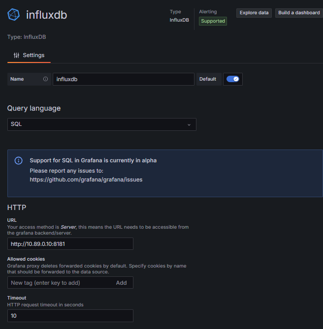

    **NOTE**: we set SQL as the query language because is the recommended for `InfluxDB` 3.0 and also is the one that let authentication with the token only.

    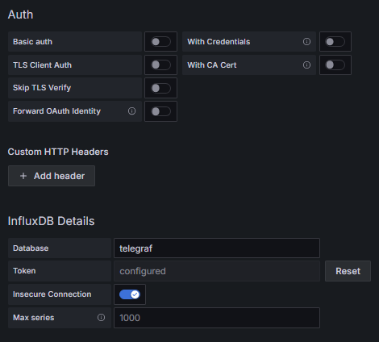

    - Then you need to press the `Save & Test` button to test the connection to `InfluxDB`. If everything is ok you should see a message like this:

    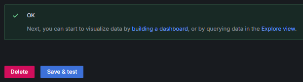

    - Now we can see the data that we have in `InfluxDB` and we can create dashboards with the data that we have in `InfluxDB`.

    - Query some data in sidebar -> `Explore` -> `InfluxDB` and select the data source that we created before. We can see the data that we have in `InfluxDB`.

    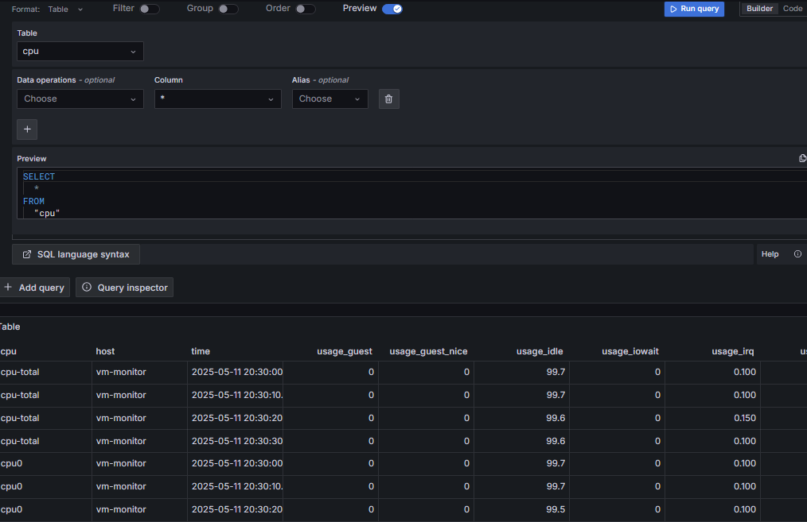

---


# 3. Connecting the other VMs to the monitoring stack

## 3.1. Basic Infrastructure info configuration 

We need to connect the other VMs to the monitoring stack. We need to install `Telegraf` in the other VMs and configure it to send the data to `InfluxDB` in the `vm-monitor` VM.

1. Open the `internal` zone in the firewall to let `Telegraf` send data to `InfluxDB` in the `vm-monitor` VM.

    ```bash
    sudo firewall-cmd --zone=internal --add-interface=enp0s8 --permanent
    sudo firewall-cmd --zone=internal --add-port=8181/tcp --permanent
    sudo firewall-cmd --zone=internal --add-source=192.168.200.10 --permanent
    sudo firewall-cmd --zone=internal --add-source=192.168.200.20 --permanent
    sudo firewall-cmd --zone=internal --add-source=192.168.200.100 --permanent
    sudo firewall-cmd --reload
    ```

    Like that we add the `vm-mgmt`, `vm-wijijs-netbox` and `vm-reproxy` internal IPs to the `vm-monitor` VM.

2. Follow the steps 1, 2, 3, and 4 as before in section 2.2 to install `Telegraf` [here](#22-installing-telegraf). This is to install `Telegraf` in the other VMs.

- In output plugin configuration just change the URLs value to point to `vm-monitor` IP address for monitoring, that is **192.168.200.31**. The rest of the configuration is the same as before.

3. For verification see `Grafana` explore, and look for hostname of the VM that you are monitoring. You should see the data from the VM in `InfluxDB` and `Grafana`. 

    - In the next image we can see all our infrastructure.

        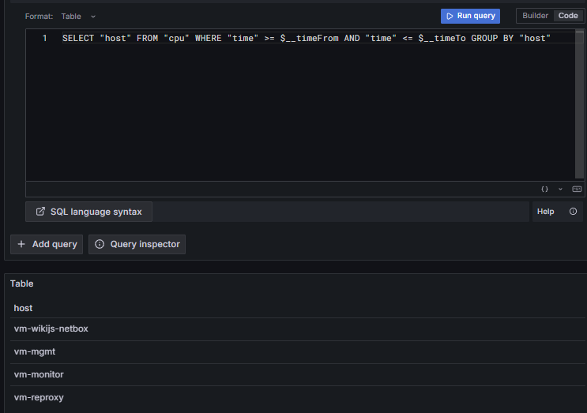

## 3.2. Additional configurations

### 3.2.1. InfluxDB configuration

TODO

---

# 4. Creating dashboards

We need to create a basic dashboard distribution to visualize the main infrastructure metrics as CPU, Memory, Disk and Network.

With all the dashboards and visualizations we need to:

1. Go to Left Sidebar -> `Dashboards` -> `Manage`.
2. Click on `New Dashboard` button.
3. Click on `Add new panel` button.
4. Select the data source that we created before.

## 4.1. Creating an overall dashboard

Follow the next configurations:

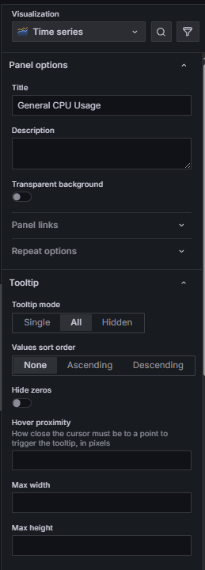

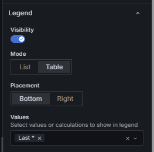

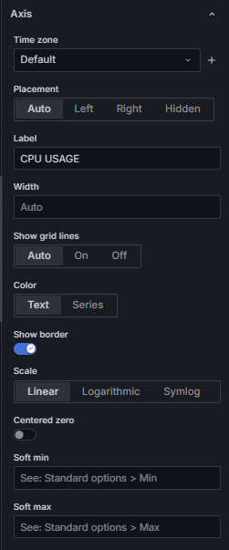

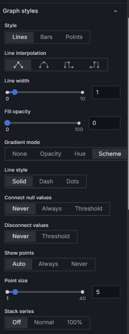

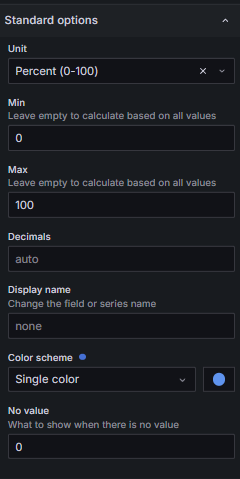

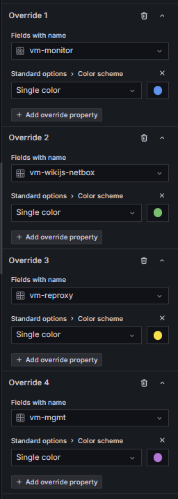

## 4.2. Creating a dashboard for each VM

For each VM we need to create a dashboard with the following metrics:

1. Disk
2. CPU
3. Memory
4. Network

So we need to follow the next steps to create the dashboards in each machine of the infrastructure. We will user `vm-monitor` as example.

For extra configuration, we will add a Variables to the dashboard, to have the `hostname` of each VM, to then used that variable to query.

- Inside of a `Dashboard` click on `Settings` button.

  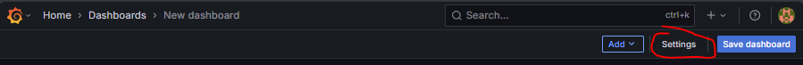

- Click on `Variables` tab.
- Click on `New variable` button and add a configuration like this

  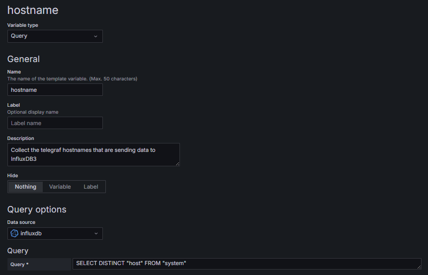

**NOTE**: With that variable we can easily clone dashboards and only change the value of hostname to the one we want to monitor. Like this:

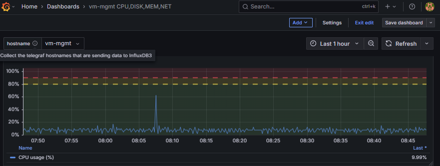

### 4.2.1. Disk metrics

#### 4.2.1.1 Root path (/)

This metrics work for all the VMs, so just change the hostname in the queries and other configurations.

1. Build the queries for to get **Disk metrics**.

    - We can use the following query to get the disk space percentage used:

        ```sql
        SELECT 
          "used_percent" AS "OS root path (/)",
          "time"
        FROM 
          "disk" 
        WHERE 
          "time" >= $__timeFrom AND "time" <= $__timeTo 
          AND "host" == '$hostname'
          AND "path" == '/'
        ```

      **NOTE**: the query name is `DiskSpaceUsage` in grafana.

    - Also we can include a table with the total disk space.

        ```sql
        SELECT 
          ("total"::float / 1073741824) AS "Total Disk Space", -- 1024^3 = 1073741824
          "time" 
        FROM 
          "disk" 
        WHERE 
          "time" >= $__timeFrom 
          AND "time" <= $__timeTo 
          AND ("path" = '/' AND "host" = '$hostname')
        ```

        **NOTE**: the query name is `TotalSpace` in grafana.

    - Now we can create a other query to get disk space used in GB.

        ```sql
        SELECT 
          ("used"::float / 1073741824) AS "Used Disk Space", -- 1024^3 = 1073741824
          "time" 
        FROM 
          "disk" 
        WHERE 
          "time" >= $__timeFrom 
          AND "time" <= $__timeTo 
          AND ("path" = '/' AND "host" = '$hostname')
        ```

        **NOTE**: the query name is `DiskSpaceUsageGB` in grafana.

2. **Grafana** `Visualization` configuration is the following:

    - For `Panel options` and `Tooltip` we can set the following configuration:

        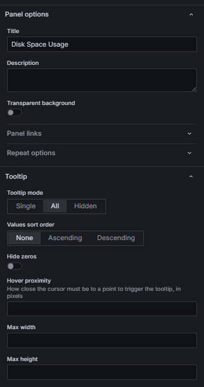

    - For `Legend` we can set the following configuration:

        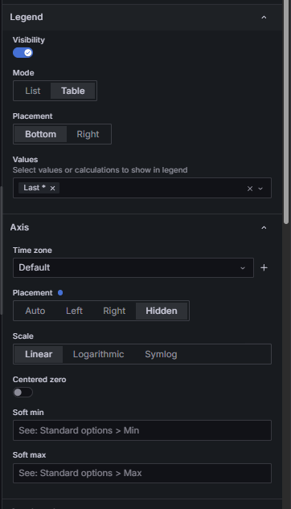

    - For `Axis` we can set the following configuration:

        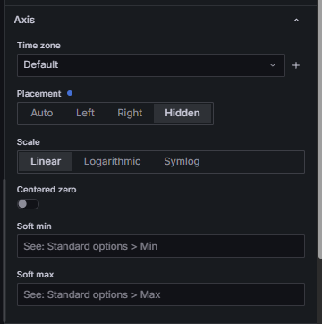

    - For `Graph styles` we can set the following configuration:

        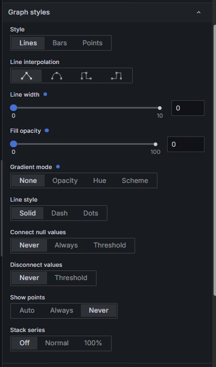

    - For `Standard options` we can set the following configuration:

        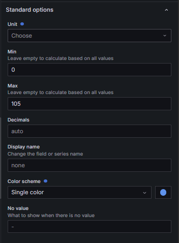

    - For `Display` we can set the following configuration:

    - For `Overrides` we can set the following configuration:

        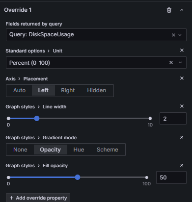
        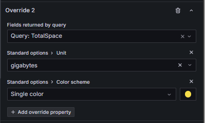
        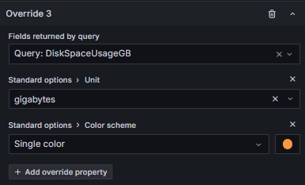

    - The final result should be something like this:

        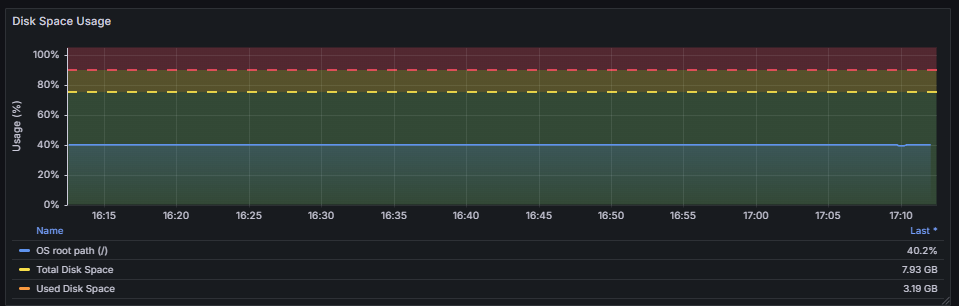

    **NOTES**: You can follow this configuration or similar for the other `Visualization` panels, I mean CPU, Memory and Network. But can be changed as needed.

#### 4.2.1.2 InfluxDB path (/srv/influxdb)

This metrics works just for the `vm-monitor` VM because us the only one that has the `/srv/influxdb` path as an extra disk and mount point.

1. We can duplicate the previous `Visualization` panel and change the query to get the disk space percentage used in `/srv/influxdb` path. See the next image:

    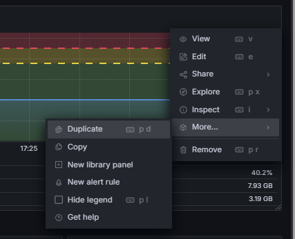

2. Then we can edit the duplicated panel and change the queries to fit the new path. This is the result then of editing the panel:

    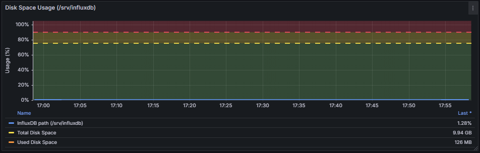

### 4.2.2. CPU metrics

7. Build the query for to get CPU usage data.

    ```sql
    SELECT 
      ("usage_active" / 2) * 100 AS "vm-monitor",
      "time"
    FROM 
      "cpu" 
    WHERE 
      "time" >= $__timeFrom AND "time" <= $__timeTo 
      AND "cpu" == 'cpu-total'
      AND "host" == '$hostname'
    ```

    - Click on `Apply` button to save the panel.

### 4.2.3. Memory metrics

8. Build the queries for to get Memory metrics.

    - We can use the following query to get the memory usage data:

        ```sql
        SELECT 
          ("used_percent" / 2) * 100 AS '$hostname',
          "time"
        FROM 
          "mem" 
        WHERE 
          "time" >= $__timeFrom AND "time" <= $__timeTo 
          AND "host" == '$hostname'
        ```

    - Click on `Apply` button to save the panel.

    - In a new `Visualization` panel we can use the following query to get a table with total memory, used memory and time.

        ```sql
        SELECT DISTINCT
          "total" / 1024 / 1024 AS "Total Memory",
          "used" / 1024 / 1024 AS "Used Memory"
        FROM 
          "mem"
        WHERE
          "time" = (SELECT MAX("time") FROM "mem") 
                AND "host" == '$hostname'
        ```

    - Click on `Save dashboard` button to save the panel.

### 4.2.4. Network metrics

TODO

### 4.2.5. Results

At the end we should have something like this:

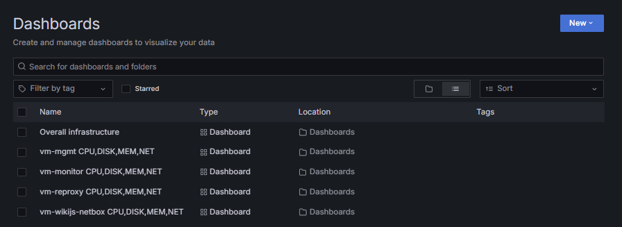

#### 4.2.5.1. Overall dashboard

At the end we should have something like this:

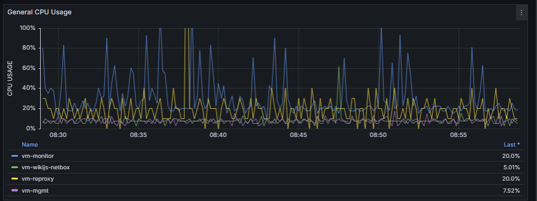

#### 4.2.5.2. VM dashboards

For example `vm-monitor` VM we should have something like this:

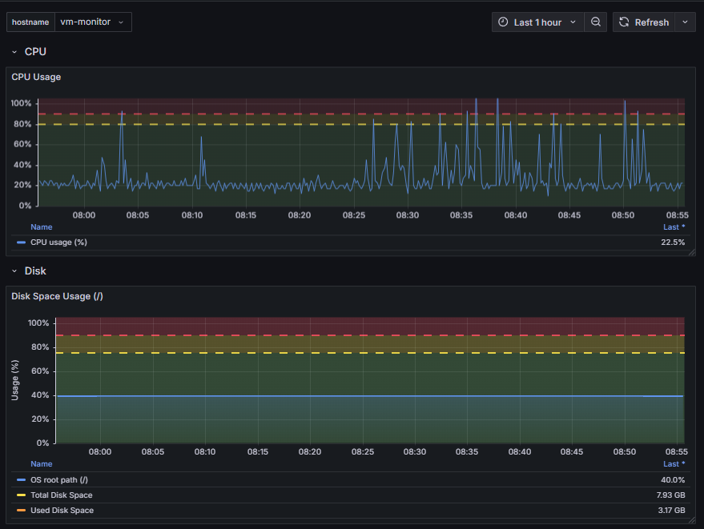

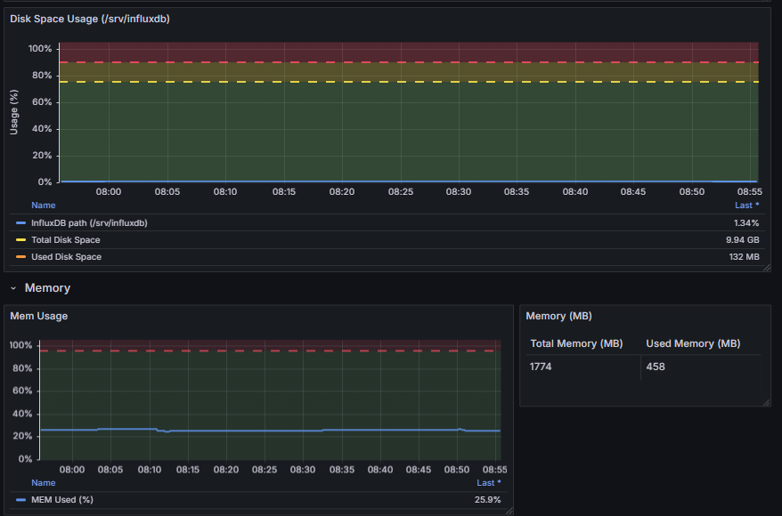

# 5. Creating alerts

## 5.1. Creating contact points

First we need to create a notification channel to send the alerts.

We are going to use `Discord` as first resource, is not the best option in security terms because is an external service but is the easiest to set up for this project.

We are going to use this **Grafana** reference: [Discord as a Contact Point](https://grafana.com/docs/grafana/latest/alerting/configure-notifications/manage-contact-points/integrations/configure-discord/).

1. Go to Left Sidebar -> `Alerting` -> `Notification channels`.
2. There we first have to create a Contact point.
3. Click on `Create contact point` button.
4. Before we need to create a **Discord** webhook.

    - Go to this link: [Discord Webhook](https://support.discord.com/hc/en-us/articles/228383668-Intro-to-Webhooks).
    - Follow the steps to create a webhook on `Making A Webhook` section.
    - Additionally add a channel for the alerts.
    - Copy the webhook URL and save it in a safe place. In my case I use **bitwarden** to save the URL.
    - Now we can create the contact point in **Grafana**.

5. Set the following configuration:

    - Name: `Discord Own Server`
    - Type: `Discord`
    - URL: `WEBHOOK_URL` (the one you created before)

6. Before accepting the configuration we need to test in the `Test` button. You should see a message like this:

    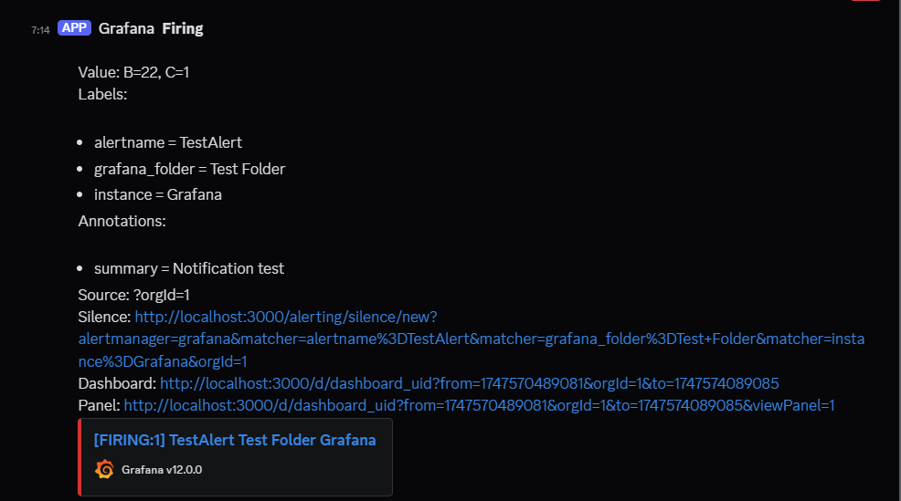

7. Now save.

## 5.2. Creating the alert

Now we will use the contact point to send the alerts to `Discord` channel.

1. Go to Left Sidebar -> `Alerting` -> `Alert rules`.

2. Click on `New alert rule` button.

3. We are going to create an alert for `vm-monitor` VM, and then replicate the alert for the other VMs.

### 5.2.1. Disk usage alert

Set the following configuration:

1. `Enter alert rule name` and `Define query and alert condition` section:

    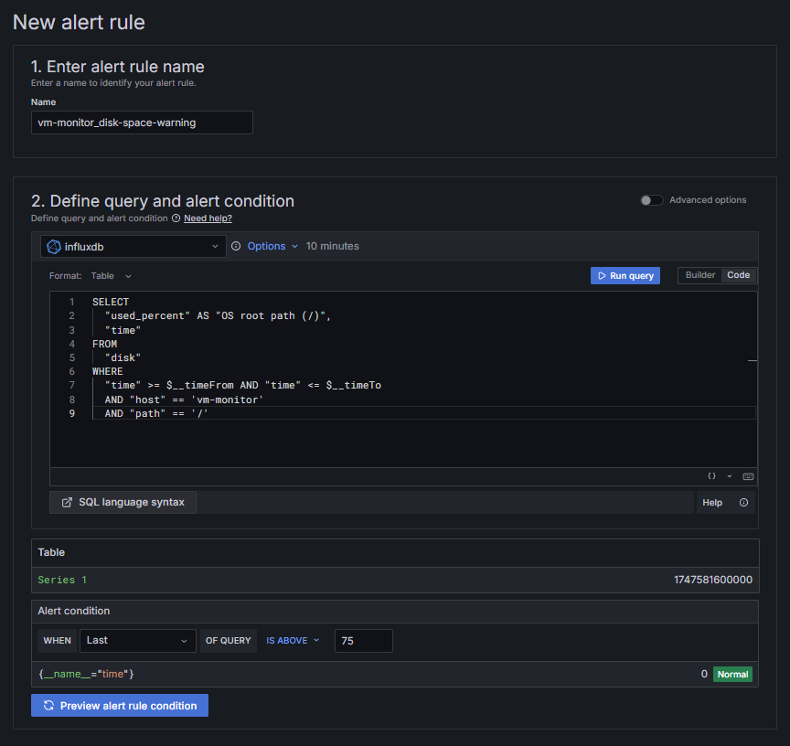

    **Notes**

    This alert is a first warning for disk usage, so that the threshold is set to 75% of disk usage. We can set a lower threshold if we want to be more strict with the disk usage.

2. `Add folder and labels` and `Set evaluation behavior` section:

    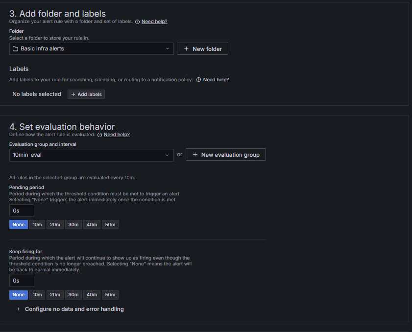

    **NOTES**

    We have `Pending period` in `NONE` because we don't want to wait for the alert to be triggered. We want to be notified as soon as the alert is triggered.

    We create an `Evaluation group` for the alert and similar alerts: 

    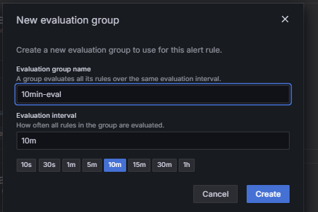

    It have 10-min interval because disk usage is not a metric that change too fast, so we can set a longer interval.

3. `Configure notifications` and `Configure notification message` section:

    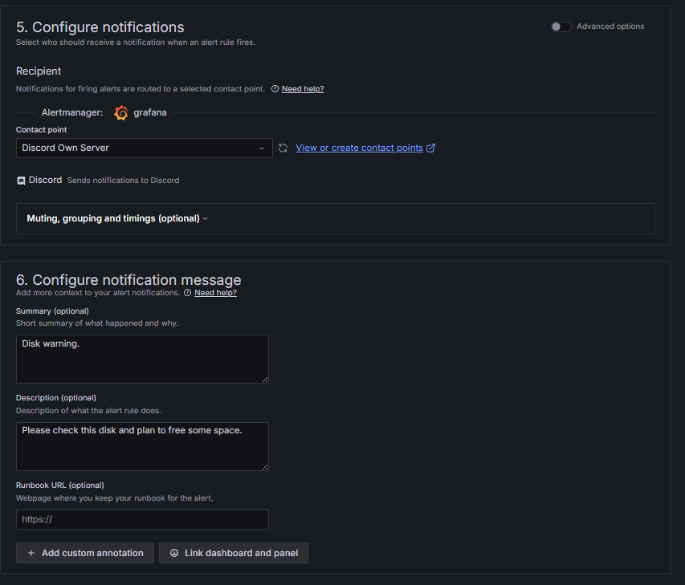

4. Click on `Save` button to save the alert.

5. Testing the alert allocating a file in the `/` partition. We can use the following command:

    ```bash
    sudo dd if=/dev/zero of=/testfile0 bs=1G count=1
    sudo dd if=/dev/zero of=/testfile1 bs=1G count=1
    sudo dd if=/dev/zero of=/testfile2 bs=1G count=1
    ```

    - We can see it in `Grafana` dashboard. We can see the disk usage in the `/` partition. The disk usage should be over 75% and the alert should be triggered.

        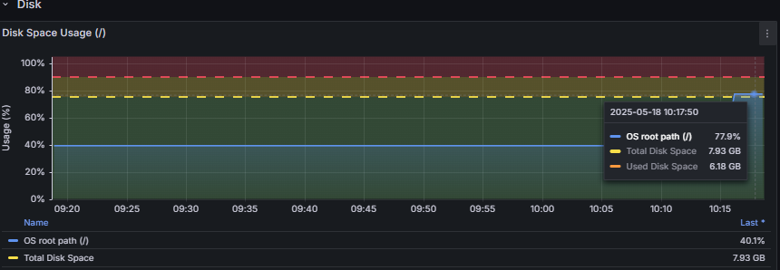

    - Check the alert in `Discord` channel. You should see a message like this:

        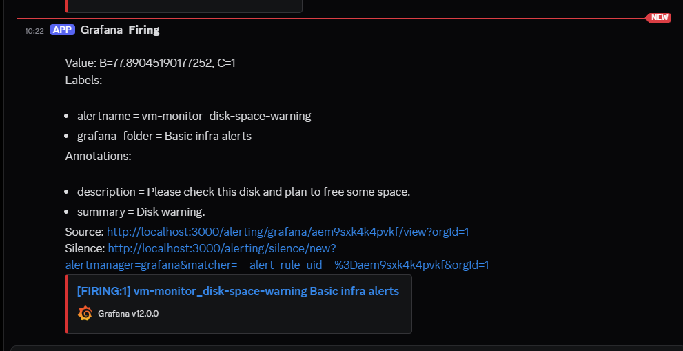

    - Erase the file after testing:

        ```bash
        sudo rm -rf /testfile0
        sudo rm -rf /testfile1
        sudo rm -rf /testfile2
        ```

6. Now lets replicate the alert for the other VMs.

7. Extra: For the `vm-monitor` VM we can create an alert for the `/srv/influxdb` partition, only changing the path in the query.

**For the moment we have this basic alerts for our Infrastructure:**

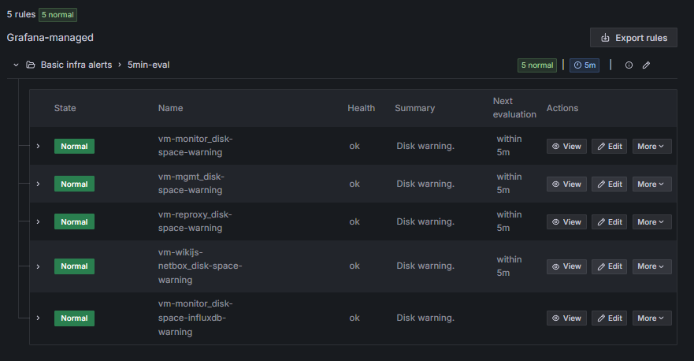

**We consider this as a basic alert for the project, to meet the basic requirements for alerting.**

### 5.2.2. CPU usage alert

TODO (Improve the alert to be more strict with the CPU usage)

### 5.2.3. Memory usage alert

TODO (Improve the alert to be more strict with the Memory usage)

### 5.2.4. Network usage alert

TODO (Improve the alert to be more strict with the Network usage)

# 6. Extra configurations

## 6.1. vm-wikijs-netbox

Now we use the following commands when up with `podman-compose`:

```bash
podman-compose -f netbox-set-compose.yml -p netbox-set up -d
podman-compose -f wikijs-set-compose.yml -p wikijs-set up -d
```

This is because podman-compose make a single pod for all the compose it runs. So to insolate the containers for each set of services, we need to define a different pod name for each compose file.
