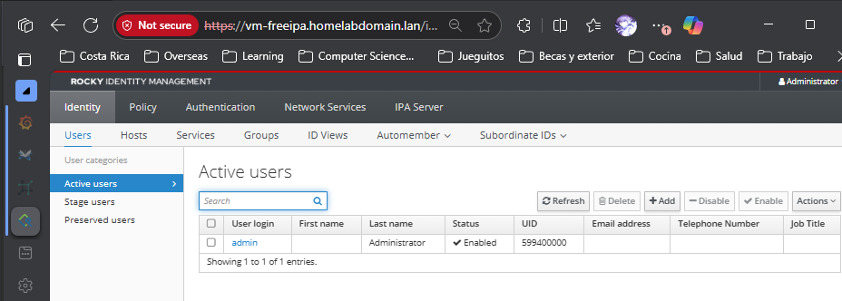
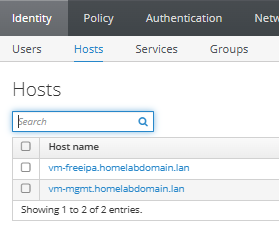
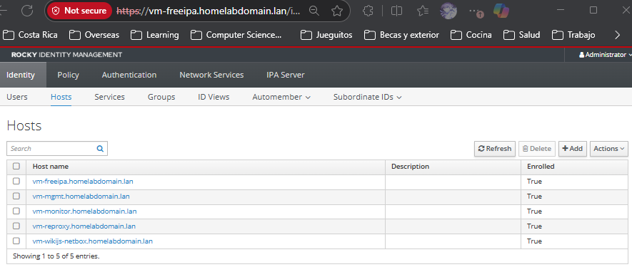

# Installation guide

## Summary

The last past part of the project was about Container Deployment and Security. This part is the continuation of the previous project.


## Objectives

1. Implement a new VM with the monitoring stack.
2. Install the required tools in existing VMs.
3. Create a monitoring dashboard with Grafana.
4. Create alerts with Grafana.

## Accumulated knowledge

### Project 1

**Deployment 3.**

- Admin Services stack (all containers)
  - Wikijs + PostgreSQL.
  - Netbox + PostgreSQL + Redis Queue + Redis Cache.
- Nginx Reverse Proxy
- Cockpit
- Podman
- Compose-Orchestrator.
  - podman-compose

### Project 2

**Deployment 1.**:

- Monitoring stack
  - Telegraf
  - InfluxDB
  - Grafana

See the Architecture design monitoring for the complete architecture of the project.

### Project 3

**Deployment 1.**:

- Domain Controller:
  - FreeIPA.

# Prerequisites

## Security

We have in backlog activating selinux in the VMs, so we are doing that now in before starting with FreeIPA installation.

We are going to use `audit2why` and `audit2allow` to generate the SELinux rules for the actual services we have in the VMs.

### vm-mgmt

No need of extra configuration, SELinux is already enabled in the VM.

```text
[admin@vm-mgmt ~]$ sestatus
SELinux status:                 enabled
SELinuxfs mount:                /sys/fs/selinux
SELinux root directory:         /etc/selinux
Loaded policy name:             targeted
Current mode:                   enforcing
Mode from config file:          enforcing
Policy MLS status:              enabled
Policy deny_unknown status:     allowed
Memory protection checking:     actual (secure)
Max kernel policy version:      33
```

### vm-reproxy

We need to check this machine to enable SELinux and allow `nginx` reproxy configuration to work properly.

1. Check `audit.log` for SELinux denials with `audit2why`.

    ```bash
    sudo cat /var/log/audit/audit.log | audit2why
    ```

    Related errors:
        1. The ports 8000, 8080 and 3000 where nginx is listening have to be allowed by SELinux.
        2. The http network connectivity have to be allowed by SELinux.

2. With the following commands we allow the previous errors:

    ```bash
    sudo setsebool -P httpd_can_network_connect 1
    sudo setsebool -P httpd_can_network_relay 1
    sudo semanage port -a -t http_port_t -p tcp 8000
    sudo semanage port -a -t http_port_t -p tcp 8080
    sudo semanage port -a -t http_port_t -p tcp 3000
    ```

    - Check the SELinux with `semanage port -l | grep http_port_t` command to see the ports allowed by SELinux.
    - Check the SELinux with `semanage boolean -l | grep httpd_can_network_connect` command to see the booleans allowed by SELinux.
    - Check the SELinux with `semanage boolean -l | grep httpd_can_network_relay` command to see the booleans allowed by SELinux.
    - All with sudo.

3. Put SELinux in enforcing mode in `/etc/selinux/config`.

4. Restart the VM.

5. Check the SELinux status with `sestatus` command.

    ```text
    [admin@vm-reproxy ~]$ sestatus
    SELinux status:                 enabled
    SELinuxfs mount:                /sys/fs/selinux
    SELinux root directory:         /etc/selinux
    Loaded policy name:             targeted
    Current mode:                   enforcing
    Mode from config file:          enforcing
    Policy MLS status:              enabled
    Policy deny_unknown status:     allowed
    Memory protection checking:     actual (secure)
    Max kernel policy version:      33
    ```

6. Check audit log with `sudo cat /var/log/audit/audit.log | audit2why` command. If there are no errors, we are good to go.

### vm-wikijs-netbox

1. We run the `audit2why` command to check if there are any SELinux denials.

    ```bash
    sudo cat /var/log/audit/audit.log | audit2why
    ```

    Issues:
    - container_t is not allowed to connect to proc_t due to the SELinux policy.

2. We active enforcing, and the previous error is not an issue to run the containers.
3. Check the SELinux status with `sestatus` command.

    ```text
    [admin@vm-wikijs-netbox ~]$ sestatus
    SELinux status:                 enabled
    SELinuxfs mount:                /sys/fs/selinux
    SELinux root directory:         /etc/selinux
    Loaded policy name:             targeted
    Current mode:                   enforcing
    Mode from config file:          enforcing
    Policy MLS status:              enabled
    Policy deny_unknown status:     allowed
    Memory protection checking:     actual (secure)
    Max kernel policy version:      33
    ```

### vm-monitor

1. We run the `audit2why` command to check if there are any SELinux denials.

    ```bash
    sudo cat /var/log/audit/audit.log | audit2why
    ```

    Issues:
    - container_t is not allowed to connect to unlabeled_t due to the SELinux policy.

2. But no need to worry about this, because the containers are running fine, and when unlabeled_t is something like a temporary file, that use container_t context when run containers.
3. Check the SELinux status with `sestatus` command.

    ```text
    [admin@vm-monitor ~]$ sestatus
    SELinux status:                 enabled
    SELinuxfs mount:                /sys/fs/selinux
    SELinux root directory:         /etc/selinux
    Loaded policy name:             targeted
    Current mode:                   enforcing
    Mode from config file:          enforcing
    Policy MLS status:              enabled
    Policy deny_unknown status:     allowed
    Memory protection checking:     actual (secure)
    Max kernel policy version:      33
    ```

## Containers with podman

I realize about an error with rootless and deamonless podman containers, I address the issue in the troubleshooting section.

See the **Troubleshooting** markdown file section [1.1. containers acquired locks ERROR](/pages/installation-guide/Troubleshooting.md#11-containers-acquired-locks-error) for more information.

## Change admin user to admin-local

We have a conflict with the admin user in FreeIPA, and to avoid this conflict, we are going to change the admin user in each VM to `admin-local`. This way, we can use the `admin` user for FreeIPA without conflicts.

Creating a new user `admin-local` in each VM as `admin` user:

sudo useradd -m -s /bin/bash admin-local
sudo passwd admin-local
sudo usermod -aG wheel admin-local
id admin-local

Deleting the `admin` user in each VM:

sudo usermod -L admin
sudo gpasswd -d admin wheel
sudo userdel -r admin
id admin

## Network configuration

Create a new host-only network in VirtualBox with the following for the domain controller services.

The IP range will be 192.168.202.0/24, and the gateway will be 192.168.202.1.

This network will be used for the Domain Controller services, and the each VM will be connected to this network.

- Make a new interface for each VM in VirtualBox and assign the designed IPs and add them to the new Host-Only network.

# 1. Installing FreeIPA

Reference: [FreeIPA Installation Guide](https://www.howtoforge.com/how-to-install-freeipa-on-rocky-linux-9/#:~:text=In%20this%20tutorial%2C%20you%20will%20install%20and%20set,you%20will%20also%20set%20up%20a%20FreeIPA%20user.)

This will be installed in `vm-mgmt` to complete the Domain Controller management of the project.

  165  sudo nmtui
  166  sestatus

Set the hostname to `vm-freeipa.homelabdomain.lan`:

  167  sudo hostnamectl set-hostname vm-freeipa.homelabdomain.lan
  168  sudo nano /etc/hosts
```text
# ip - fqdn - hostname
192.168.202.11   vm-freeipa.homelabdomain.lan    vm-freeipa
```
  169  sudo hostname -f
  171  sudo ping -c3 vm-freeipa.homelabdomain.lan

Set the timezone to America/Costa_Rica:

  172  sudo timedatectl set-timezone
  173  sudo timedatectl set-timezone
  174  sudo timedatectl set-timezone --help
  175  You can list all available time zones using the following command:
  176  timedatectl list-timezones

This will display a list of valid time zones that you can use with the set-timezone command. Once you find the correct time zone, you can set it using:
 
  178  sudo timedatectl set-timezone America/Costa_Rica

You can also check your current time zone with:

  182  timedatectl status

Set the localtime to America/Costa_Rica:

  203  sudo unlink /etc/localtime
  204  sudo ln -s /usr/share/zoneinfo/America/Costa_Rica /etc/localtime
  205  ll /etc/localtime
  206  timedatectl status

Add the network interface to the internal zone in the firewall:

  207  sudo firewall-cmd --list-all-zone

Create a zone called domain-controller-internal:
  208  sudo firewall-cmd --new-zone=dc-internal --permanent 

Add rules to the domain-controller zone:

sudo firewall-cmd --zone=dc-internal --add-interface=enp0s9 --permanent
sudo firewall-cmd --zone=dc-internal --add-service={freeipa-ldap,freeipa-ldaps,dns,ntp,http,https,kerberos} --permanent
sudo firewall-cmd --reload
sudo firewall-cmd --list-all-zone

Install FreeIPA server and client packages:

```bash
sudo dnf install freeipa-server freeipa-server-dns freeipa-client
```

Configure the FreeIPA server:

```bash
umask 0022
sudo umask 0022
sudo ipa-server-install --setup-dns
```

See the interactive prompts during the installation. You will be asked to provide the following information:

**NOTE**: When not value is provided, the default value will be used.

```text
The log file for this installation can be found in /var/log/ipaserver-install.log
==============================================================================
This program will set up the IPA Server.
Version 4.12.2

This includes:
  * Configure a stand-alone CA (dogtag) for certificate management
  * Configure the NTP client (chronyd)
  * Create and configure an instance of Directory Server
  * Create and configure a Kerberos Key Distribution Center (KDC)
  * Configure Apache (httpd)
  * Configure DNS (bind)
  * Configure SID generation
  * Configure the KDC to enable PKINIT

To accept the default shown in brackets, press the Enter key.

Enter the fully qualified domain name of the computer
on which you're setting up server software. Using the form
<hostname>.<domainname>
Example: master.example.com


Server host name [vm-freeipa.homelabdomain.lan]:

Warning: skipping DNS resolution of host vm-freeipa.homelabdomain.lan
The domain name has been determined based on the host name.

Please confirm the domain name [homelabdomain.lan]:

The kerberos protocol requires a Realm name to be defined.
This is typically the domain name converted to uppercase.

Please provide a realm name [HOMELABDOMAIN.LAN]:
Certain directory server operations require an administrative user.
This user is referred to as the Directory Manager and has full access
to the Directory for system management tasks and will be added to the
instance of directory server created for IPA.
The password must be at least 8 characters long.

Directory Manager password:
Password (confirm):

The IPA server requires an administrative user, named 'admin'.
This user is a regular system account used for IPA server administration.

IPA admin password:
Password (confirm):

Checking DNS domain homelabdomain.lan., please wait ...
Do you want to configure DNS forwarders? [yes]:
Following DNS servers are configured in /etc/resolv.conf: 8.8.8.8, 8.8.4.4
Do you want to configure these servers as DNS forwarders? [yes]:
All detected DNS servers were added. You can enter additional addresses now:
Enter an IP address for a DNS forwarder, or press Enter to skip:
DNS forwarders: 8.8.8.8, 8.8.4.4
Checking DNS forwarders, please wait ...
Do you want to search for missing reverse zones? [yes]:
Checking DNS domain 202.168.192.in-addr.arpa., please wait ...
Do you want to create reverse zone for IP 192.168.202.11 [yes]:
Please specify the reverse zone name [202.168.192.in-addr.arpa.]:
Checking DNS domain 202.168.192.in-addr.arpa., please wait ...
Using reverse zone(s) 202.168.192.in-addr.arpa.
Trust is configured but no NetBIOS domain name found, setting it now.
Enter the NetBIOS name for the IPA domain.
Only up to 15 uppercase ASCII letters, digits and dashes are allowed.
Example: EXAMPLE.


NetBIOS domain name [HOMELABDOMAIN]:

Do you want to configure chrony with NTP server or pool address? [no]:
```

FreeIPA configuration at this point will be:

```text
The IPA Master Server will be configured with:
Hostname:       vm-freeipa.homelabdomain.lan
IP address(es): 192.168.202.11
Domain name:    homelabdomain.lan
Realm name:     HOMELABDOMAIN.LAN

The CA will be configured with:
Subject DN:   CN=Certificate Authority,O=HOMELABDOMAIN.LAN
Subject base: O=HOMELABDOMAIN.LAN
Chaining:     self-signed

BIND DNS server will be configured to serve IPA domain with:
Forwarders:       8.8.8.8, 8.8.4.4
Forward policy:   only
Reverse zone(s):  202.168.192.in-addr.arpa.
```

Next step is creating a Kerberos Ticket for the IPA admin user:

```bash
kinit admin
```

Now verify the authentication and list of obtained Kerberos tickets by entering the following 'klist' command.

```bash
klist
```

Output will be similar to:

  ```bash
  Valid starting       Expires              Service principal
  05/31/2025 14:57:39  06/01/2025 14:49:49  krbtgt/HOMELABDOMAIN.LAN@HOMELABDOMAIN.LAN
  ```

Now you have to be able to log in to the FreeIPA web interface using the admin user:
Open a web browser and navigate to the FreeIPA web interface:

```text
https://vm-freeipa.homelabdomain.lan/
```

In your host computer, where you run **VirtualBox**. Here you have two options to access the FreeIPA web interface:
1. **Using the Host-Only IP**: You can access the FreeIPA web interface using the Host-Only IP of the `vm-freeipa` VM, which is `192.168.202.11`.
2. Mapping the `vm-freeipa.homelabdomain.lan` domain to the Host-Only IP in your host computer's `/etc/hosts` file. This way, you can access the FreeIPA web interface using the FQDN `vm-freeipa.homelabdomain.lan`.


With any option to should see login page, there you can log in with the `admin` user and the password you set during the FreeIPA installation.

Then this is the main page of the FreeIPA web interface:



# Post-installation of FreeIPA

## Adding new machines to FreeIPA

To add new machines to FreeIPA, you can use the `ipa-client-install` command in each machine you want to add.

Overall steps are:

- Set up the hostname and domain name in the client machine.
- Add host **DNS** records from **FreeIPA Server**.
- Set up `/etc/hosts` file and `/etc/resolv.conf` file.
- Installing **FreeIPA** client and adding host via `ipa-client-install`

We are going to add the `vm-mgmt` machine to **FreeIPA** as an example. You can run the following command in the `vm-mgmt` machine:

### Set up the hostname and domain name in the client machine

First, you need to set the hostname and domain name in the **client machine** (`vm-mgmt`).

1. Set the hostname to `vm-mgmt.homelabdomain.lan`:

    ```bash
    sudo hostnamectl set-hostname vm-mgmt.homelabdomain.lan
    ```

2. Verify the hostname:

    ```bash
    hostname -f
    ```

### Add the host DNS records in FreeIPA

Server: `vm-freeipa`

First, you must add the DNS record of your client machine to the **FreeIPA server**.

From your IPA server (in this case, `vm-freeipa`), run the following command to add the DNS record for the `vm-mgmt` machine:

1. Add the DNS record for the `vm-mgmt` machine:

    ```bash
    ipa dnsrecord-add homelabdomain.lan vm-mgmt --a-rec 192.168.202.10
    ```

     - If you need to delete the DNS record, you can use the following command:

       ```bash
       ipa dnsrecord-del homelabdomain.lan vm-mgmt
       ```

2. Verify that the DNS record was added successfully:

    ```bash
    ipa dnsrecord-find homelabdomain.lan vm-mgmt
    ```

    Example output:

    ```text
      Record name: vm-mgmt
      A record: 192.168.202.10
    ----------------------------
    Number of entries returned 1
    ----------------------------
    ```

3. Verify with `dig` command that the DNS record is working:

    ```bash
    dig vm-mgmt.homelabdomain.lan
    ```

    Example output:

    ```text
    ; <<>> DiG 9.16.23-RH <<>> vm-mgmt.homelabdomain.lan
    ;; global options: +cmd
    ;; Got answer:
    ;; ->>HEADER<<- opcode: QUERY, status: NOERROR, id: 62707
    ;; flags: qr aa rd ra; QUERY: 1, ANSWER: 1, AUTHORITY: 0, ADDITIONAL: 1

    ;; OPT PSEUDOSECTION:
    ; EDNS: version: 0, flags:; udp: 1232
    ; COOKIE: fd5328c73178a5aa01000000683b8ba4fd2456cbf8c3b85b (good)
    ;; QUESTION SECTION:
    ;vm-mgmt.homelabdomain.lan.     IN      A

    ;; ANSWER SECTION:
    vm-mgmt.homelabdomain.lan. 86400 IN     A       192.168.202.10
    ```

4. Now you can proceed to set up the `/etc/hosts` and `/etc/resolv.conf` files in the `vm-mgmt` machine.

### Set up `/etc/hosts` and `/etc/resolv.conf`

Server: `vm-mgmt`.

Connected to the client machine (`vm-mgmt`), you need to set up the `/etc/hosts` and `/etc/resolv.conf` files to resolve the FreeIPA server hostname.

1. Edit the `/etc/hosts` file to add the FreeIPA server hostname:

    ```bash
    sudo nano /etc/hosts
    ```

    Add the following line:

    ```text
    # ip - fqdn/domain - hostname
    192.168.202.11 vm-freeipa.homelabdomain.lan vm-freeipa
    ```

2. Edit the `/etc/resolv.conf` file to add the FreeIPA server as a nameserver:

    ```bash
    sudo nano /etc/resolv.conf
    ```

    Add the following line at the top of the file:

    ```text
    # list resolver
    nameserver 192.168.202.11
    ```

3. Test with ping the FreeIPA server to ensure that the hostname resolves correctly, also the self domain name:

    ```bash
    ping -c3 vm-freeipa.homelabdomain.lan
    ping -c3 vm-mgmt.homelabdomain.lan
    ```

    You should see a response from the FreeIPA server.

4. Now you can proceed to install the FreeIPA client in the `vm-mgmt` machine.

### Install and configuring the FreeIPA client

This section will guide you through the installation and configuration of the FreeIPA client in the `vm-mgmt` machine.

1. Install the FreeIPA client package and the `oddjob-mkhomedir` package, which is used to create home directories for users when they log in:

    ```bash
    sudo dnf install freeipa-client oddjob-mkhomedir
    ```

2. After the installation, you can run the `ipa-client-install` command to configure the FreeIPA client. This command will automatically detect the FreeIPA server and configure the client accordingly.

    ```bash
    sudo ipa-client-install --hostname=`hostname -f` --mkhomedir --server=vm-freeipa.homelabdomain.lan --domain=homelabdomain.lan --realm=HOMELABDOMAIN.LAN
    ```

    - Configuration will be similar to the following:

    ```text
    This program will set up IPA client.
    Version 4.12.2

    Autodiscovery of servers for failover cannot work with this configuration.
    If you proceed with the installation, services will be configured to always access the discovered server for all operations and will not fail over to other servers in case of failure.
    Proceed with fixed values and no DNS discovery? [no]: yes
    Do you want to configure chrony with NTP server or pool address? [no]: no
    Client hostname: vm-mgmt.homelabdomain.lan
    Realm: HOMELABDOMAIN.LAN
    DNS Domain: homelabdomain.lan
    IPA Server: vm-freeipa.homelabdomain.lan
    BaseDN: dc=homelabdomain,dc=lan

    Continue to configure the system with these values? [no]: yes
    Synchronizing time
    No SRV records of NTP servers found and no NTP server or pool address was provided.
    Using default chrony configuration.
    Attempting to sync time with chronyc.
    Time synchronization was successful.
    User authorized to enroll computers: admin
    Password for admin@HOMELABDOMAIN.LAN:
    Successfully retrieved CA cert
        Subject:     CN=Certificate Authority,O=HOMELABDOMAIN.LAN
        Issuer:      CN=Certificate Authority,O=HOMELABDOMAIN.LAN
        Valid From:  2025-05-31 20:47:30+00:00
        Valid Until: 2045-05-31 20:47:30+00:00

    Enrolled in IPA realm HOMELABDOMAIN.LAN
    Created /etc/ipa/default.conf
    Configured /etc/sssd/sssd.conf
    Systemwide CA database updated.
    Hostname (vm-mgmt.homelabdomain.lan) does not have A/AAAA record.
    Failed to update DNS records.
    Missing A/AAAA record(s) for host vm-mgmt.homelabdomain.lan: 192.168.202.10.
    Missing reverse record(s) for address(es): 192.168.202.10.
    Adding SSH public key from /etc/ssh/ssh_host_ed25519_key.pub
    Adding SSH public key from /etc/ssh/ssh_host_ecdsa_key.pub
    Adding SSH public key from /etc/ssh/ssh_host_rsa_key.pub
    Could not update DNS SSHFP records.
    SSSD enabled
    Configured /etc/openldap/ldap.conf
    Configured /etc/ssh/ssh_config
    Configured /etc/ssh/sshd_config.d/04-ipa.conf
    Configuring homelabdomain.lan as NIS domain.
    Configured /etc/krb5.conf for IPA realm HOMELABDOMAIN.LAN
    Client configuration complete.
    The ipa-client-install command was successful
    ```

    - This is the client configuration that was applied:

    ```text
    Client hostname: vm-mgmt.homelabdomain.lan
    Realm: HOMELABDOMAIN.LAN
    DNS Domain: homelabdomain.lan
    IPA Server: vm-freeipa.homelabdomain.lan
    BaseDN: dc=homelabdomain,dc=lan
    ```

3. Now we are good to verify the FreeIPA client installation and configuration.

    - First log in as ssh user `sshuser`:

    ```bash
    ssh sshuser@localhost -p 2222
    ```

    - Then, you can verify the FreeIPA user authentication by running the following command:

    ```bash
    su - admin
    ```

    **NOTE**: `admin` is the FreeIPA admin user, and you will be prompted to enter the password you set during the FreeIPA installation.

    - See we didn't have a admin directory created before executing the above command.

    ```text
    [admin-local@vm-mgmt home]$ ll
    total 0
    drwx------. 3 admin-local admin-local 74 May 31 10:43 admin-local
    drwx------. 2 sshuser     sshuser     83 Apr 13 15:23 sshuser
    ```

    - After running the `su - admin` command, you should see that the home directory for the `admin` user is created, and you are logged in as the `admin` user:

    ```text
    [admin-local@vm-mgmt home]$ ll
    total 0
    drwx------. 2 admin       admins      62 May 31 17:45 admin
    drwx------. 3 admin-local admin-local 74 May 31 10:43 admin-local
    drwx------. 2 sshuser     sshuser     83 Apr 13 15:23 sshuser
    ```

4. Verify in web interface that the `vm-mgmt` machine is added to FreeIPA:

    - Go to the **Identity >> Hosts** section in the FreeIPA web interface.
    - You should see the `vm-mgmt.homelabdomain.lan` host listed there.

    

### Conclusion

This config have to be done in each client machine you want to add to FreeIPA, so you can manage the users and groups in the FreeIPA server and use them in the client machines.

In this case we have all the machines listed. See ta image below:



---

## Adding new hosts groups to FreeIPA

Now that we have the FreeIPA server installed and configured, we can add new host groups to FreeIPA. This will allow us to manage the hosts in groups and apply policies to them.

According with the implementation architecture design, we are going to create the following host groups:

- **management-hosts**: includes the management machines, like `vm-mgmt` and `vm-freeipa`.
- **app-services-hosts**: includes the application services machines, like `vm-wikijs-netbox` and `vm-reproxy`.
- **monitoring-hosts**: includes the monitoring machines, like `vm-monitor`.

### Adding the `management-hosts` group

1. Go to the **Identity >> Host Groups** section in the FreeIPA web interface.
2. Click on the **Add** button to create a new host group.
3. Fill in the form with the following information:

    - **Group name**: `management-hosts`
    - **Description**: `Management hosts group`

4. Click on the **Add and Edit** button to create the group.
5. Add the `vm-freeipa` and `vm-mgmt` hosts to the `management-hosts` group.

    - Click on the **Hosts** tab.
    - Click on the **Add** button.
    - Select the `vm-freeipa.homelabdomain.lan` and `vm-mgmt.homelabdomain.lan` hosts from the list.
    - Click on **Add** button to add the hosts to the group.

6. Click on **Save** button to create the group.

### Adding the `app-services-hosts` group

1. Go to the **Identity >> Host Groups** section in the FreeIPA web interface.
2. Click on the **Add** button to create a new host group.
3. Fill in the form with the following information:

    - **Group name**: `app-services-hosts`
    - **Description**: `Application services hosts group`

4. Click on the **Add and Edit** button to create the group.
5. Add the `vm-wikijs-netbox` and `vm-reproxy` hosts to the `app-services-hosts` group.

    - Click on the **Hosts** tab.
    - Click on the **Add** button.
    - Select the `vm-wikijs-netbox.homelabdomain.lan` and `vm-reproxy.homelabdomain.lan` hosts from the list.
    - Click on **Add** button to add the hosts to the group.

6. Click on **Save** button to create the group.

### Adding the `monitoring-hosts` group

1. Go to the **Identity >> Host Groups** section in the FreeIPA web interface.
2. Click on the **Add** button to create a new host group.
3. Fill in the form with the following information:

    - **Group name**: `monitoring-hosts`
    - **Description**: `Monitoring hosts group`

4. Click on the **Add and Edit** button to create the group.
5. Add the `vm-monitor` host to the `monitoring-hosts` group.

    - Click on the **Hosts** tab.
    - Click on the **Add** button.
    - Select the `vm-monitor.homelabdomain.lan` host from the list.
    - Click on **Add** button to add the host to the group.

6. Click on **Save** button to create the group.


## Adding new users and groups to FreeIPA

We are going to add three initial users to FreeIPA for testing purposes. The following users will be added:

- `jorgediazsagot`: This is a system administrator user with sudo privileges.
- `appsupportuser`: This is a regular user for testing purposes, that only is able to check the WikiJS, NetBox and Reverse Proxy web interfaces, and servers to see if the services are running properly.

The idea of adding these users is to test the FreeIPA authentication and authorization in the client machines.

To add this users we need groups, so we will create a group called `sysadmins` (no freeipa client access) for the `jorgediazsagot` user, and a group called `monitors` for the `appsupportuser`. The last one is only able to login to **Grafana** web interface.

### Adding the `jorge.diazsagot` user

#### Creating a group a `sysadmins`

1. Assuming you are logged in to the FreeIPA web interface as the `admin` user, go first to create a group called `sysadmins` .
2. Go to the **Identity >> Groups** section in the FreeIPA web interface.
3. Click on the **Add** button to create a new group.
4. Fill in the form with the following information:

    - **Group name**: `sysadmins`
    - **Description**: `System administrators group with sudo privileges`
    - **Group type**: `POSIX`. See more of group types in the [TODO] section.
    - **Group ID**: `10000` (or any other unused GID).

5. Click on the **Add and Edit** button to create the group.
6. Add the `sysadmin` user to the `sysadmins` group.

#### Creating the `sysadmin` user

1. Go to the **Identity >> Users** section in the FreeIPA web interface.
2. Click on the **Add** button to create a new user.
3. Fill in the form with the following information:

    - **User login**: `sysadmin`
    - **First name**: `System`
    - **Last name**: `Administrator`
    - **GID**: `10000` (is the GID of the `sysadmins` group we created before).

    **NOTE**: Set password as well.

4. Click on the **Add and Edit** button to create the user.

    - Change **Login shell** to `/bin/bash`.
    - **User Authentication types**: Select `Password`.

5. We need to go to **Identity >> Users >> sysadmin** and set the **User Groups** to `sysadmins` group we created before.

    - Click on the **Groups** tab.
    - Click on the **Add** button.
    - Select the `sysadmins` group from the list.
    - Click on **Add** button to add the group to the user.
    - Delete the `ipausers` group from the user, if it is there because this user only have access to all the unless **freeipa client**.

6. Click on **Save** button to create the user.

#### Creating a group `application-support`

1. Go to the **Identity >> Groups** section in the FreeIPA web interface.
2. Click on the **Add** button to create a new group.
3. Fill in the form with the following information:

    - **Group name**: `application-support`
    - **Description**: `Application support group with access to WikiJS, NetBox and Reverse Proxy`
    - **Group type**: `POSIX`. See more of group types in the [TODO] section.
    - **Group ID**: `10005` (or any other unused GID).

4. Click on the **Add and Edit** button to create the group.

#### Creating the `application-support-user` user

1. Go to the **Identity >> Users** section in the FreeIPA web interface.
2. Click on the **Add** button to create a new user.
3. Fill in the form with the following information:

    - **User login**: `application-support-user`
    - **First name**: `Application`
    - **Last name**: `Support`
    - **Description**: `Test user for application support purposes`

4. Click on the **Add and Edit** button to create the user.

    - **Job Title**: `SRE Professional, Application Support`
    - **Login shell**: `/bin/bash` (to avoid login to the system).
    - **User Authentication types**: Select `Password`.

5. We need to go to **Identity >> Users >> application-support-user** and set the **User Groups** to `application-support` group we created before.

    - Click on the **Groups** tab.
    - Click on the **Add** button.
    - Select the `application-support` group from the list.
    - Click on **Add** button to add the group to the user.
    - Delete the `ipausers` group from the user, if it is there.

6. Click on **Save** button to create the user.

### Set up sudo privileges for the `sysadmins` group

To allow members of the `sysadmins` group to execute commands with sudo privileges on all hosts, follow these steps using the FreeIPA command-line tools.

Execute these commands on the FreeIPA server (`vm-freeipa`) as the `admin` user which is the FreeIPA administrator:

1. Create a Sudo Rule for the sysadmins Group

    This rule will allow all commands to be run as any user or group on any host:

    ```bash
    ipa sudorule-add sysadmin_sudo --hostcat=all --runasusercat=all --runasgroupcat=all --cmdcat=all
    ```

2. Assign the sysadmins Group to the Sudo Rule. 

    Add the `sysadmins` group to the newly created sudo rule:

    ```bash
    ipa sudorule-add-user sysadmin_sudo --group sysadmins
    ```

3. Verify the Sudo Rule

    Check that the sudo rule is correctly configured:

    ```bash
    ipa sudorule-show sysadmin_sudo
    ```

    You should see output similar to:

    ```text
    Rule name: sysadmin_sudo
    Enabled: True
    Host category: all
    Command category: all
    RunAs User category: all
    RunAs Group category: all
    User Groups: sysadmins
    ```

4. **Verify the sysadmins Group**

    Confirm that the `sysadmins` group exists and is correctly set up:

    ```bash
    ipa group-find sysadmins
    ```

    You should see output similar to:

    ```text
    Group name: sysadmins
    Description: System administrators group with sudo privileges in vms.
    GID: 10000
    Member users: sysadmin, jorgediazsagot
    Member of Sudo rule: sysadmin_sudo
    ```

5. After completing these steps, all users in the `sysadmins` group will have sudo privileges on all FreeIPA-enrolled hosts.

6. To validate `jorgediazsagot` user can use sudo, log in to any host as `jorgediazsagot` and run a command with sudo:

    ```bash
    sudo whoami
    ```

    You should see `root` as the output, indicating that the command was executed with root privileges.

### Conclusion

Now we have the `sysadmins` group created with the `sysadmin` user, and the `application-support` group with the `application-support-user` user.

NOTE: Default configuration of Host-Based Access Control (HBAC) in FreeIPA allows all users to access all hosts, so we don't need to configure anything else for the `sysadmins` group.

In next sections we will modify this, to only allow access to specific hosts.
